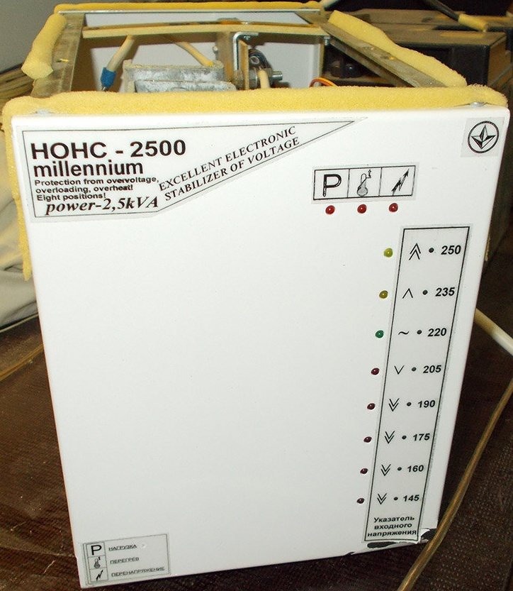
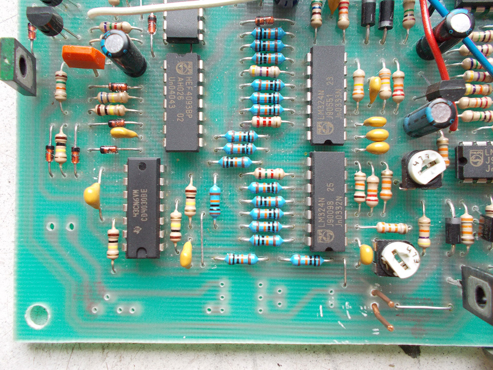
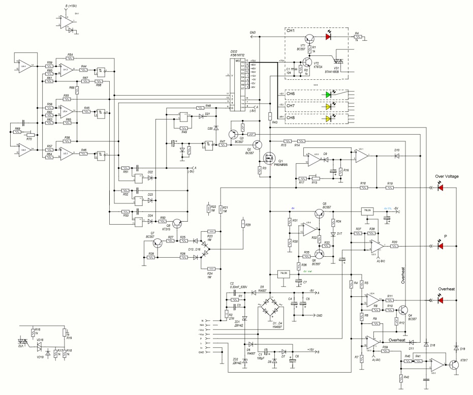

# Millennium HOHC-2500 – 8-step triac voltage stabilizer (reverse engineering)

Reverse-engineering project for the **Millennium HOHC-2500** mains voltage stabilizer.

This is an **8-step triac-based AVR (Automatic Voltage Regulator)** built **without any microcontroller** –  
all logic is implemented using **discrete logic ICs and operational amplifiers.**

Goal of the project:

- document the analog / logic control circuitry,
- understand how the 8 steps are selected and protected,
- provide reference material for repair and further study.

---

## Device identification

Front view of the unit (for visual identification):

[](./_img/face.jpg)

Click the image to open the full-size photo.

---

## Internal overview

### Main PCB – general views

The internal PCB carries:

- power section (transformer taps, triacs / power devices),
- sensing and control circuitry,
- discrete logic and op-amp based comparators for step selection.

General views of the board:

| | |
|---|---|
| [](./_img/pcb_view_1.jpg) | [](./_img/pcb_view_2.jpg) |


### PCB template photos

In `./pcb/` there are “straight-on” photos of the PCB, used as **photo templates**  
for tracing connections in Sprint-Layout:

- `./pcb/pcb_face.jpg` – front (component) side, orthogonal view  
- `./pcb/pcb_template_586_10-3_mir.jpg` – mirrored image for aligning back side / traces

> These images are **not** meant as final documentation themselves, but as working material  
> for building a Sprint-Layout project and matching front/back copper and nets.

---

## Schematic

The stabilizer is a **multi-step autotransformer / transformer with triac-switched taps**,  
controlled by analog comparators and logic (no firmware).

- `./sch_stab_2kw.spl8`  
  Reverse-drawn schematic of the stabilizer in **sPlan 8** format.  
  > Status: ~**50% complete** – work in progress.  
  > Main topology and step logic are partially captured; details and some component values  
  > still need to be verified against the real board.

### Schematic preview (image)

For quick viewing without sPlan, there is a preview JPEG export:

[](./sch_overview.jpg)

> This image is provided **just for preview** and may lag behind the  
> `sch_stab_2kw.spl8` project in terms of completeness and small corrections.  
> The sPlan file should be considered the primary, most up-to-date source.

---

## Project layout

Directory structure for this project:

```text
avr_Millennium HOHC-2500/
  _img/
    face.jpg                  – front panel / external view
    pcb_view_1.jpg            – internal PCB photo (general view)
    pcb_view_2.jpg            – internal PCB photo (general view)

  pcb/
    pcb_face.jpg              – orthogonal front-side PCB photo (template)
    pcb_template_586_10-3_mir.jpg
                              – mirrored PCB photo (used to align opposite side)

  sch_stab_2kw.spl8           – main schematic in sPlan 8 format (WIP, ~50%)
  sch_overview.jpg            – full-size schematic preview image
  README.md                   – this file
```

## Status

Current reverse-engineering progress:

- 🟡 **Schematic (`sch_stab_2kw.spl8`)** – ~50%  
  - main power path and step-selection logic partially captured,  
  - some nets / protection circuits / values still to be checked.
- 🔘 **PCB tracing in Sprint-Layout** – based on the template photos,  
  the layout is being reconstructed mainly for **net connectivity**, not for fabrication.
- 🔘 **Documentation / notes** – will be expanded as the schematic and PCB tracing approach completion.

Contributions (photos of other revisions, measurements, corrections) are welcome.

---

## Safety notice

This device works directly with **mains voltage** and **high currents**:

- 220–240 V AC input,
- autotransformer / transformer with multiple taps,
- triac-controlled switching under load.

**Danger:**

- Opening and working on the unit while connected to mains is **potentially lethal**.
- Even when unplugged, capacitors and transformer windings can hold dangerous energy.

If you use this information:

- always disconnect from mains,
- use an isolation transformer and appropriate test equipment,
- verify everything independently before powering up.

The content of this project is provided **for educational and repair purposes only**,  
with no guarantee of correctness or completeness. Use at your own risk.

---

## Trademarks & notes

- “Millennium HOHC-2500” and any related brand names/logos belong to their respective owners.
- This repository contains **reverse-engineered documentation** of an old stabilizer model  
  for study and repair; no affiliation with the original manufacturer is implied.
