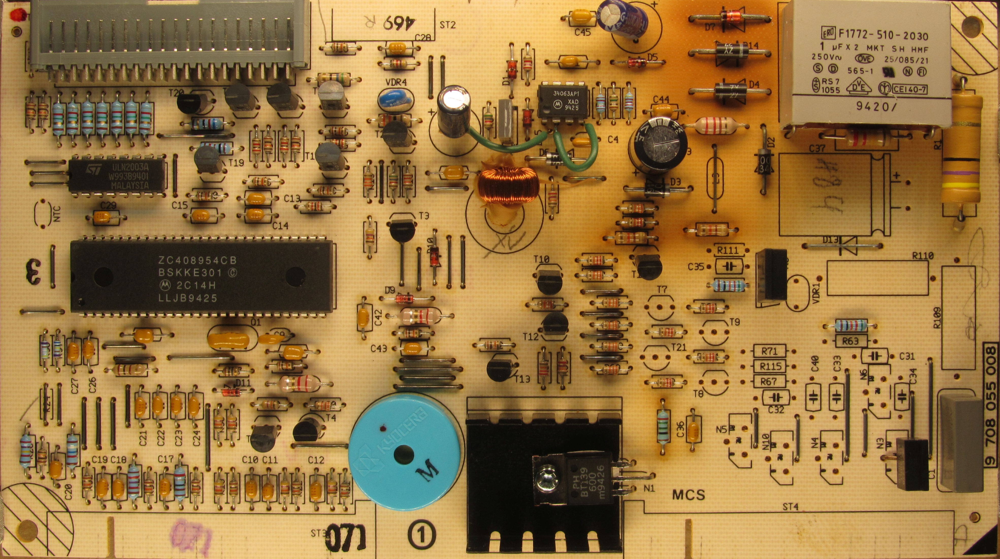
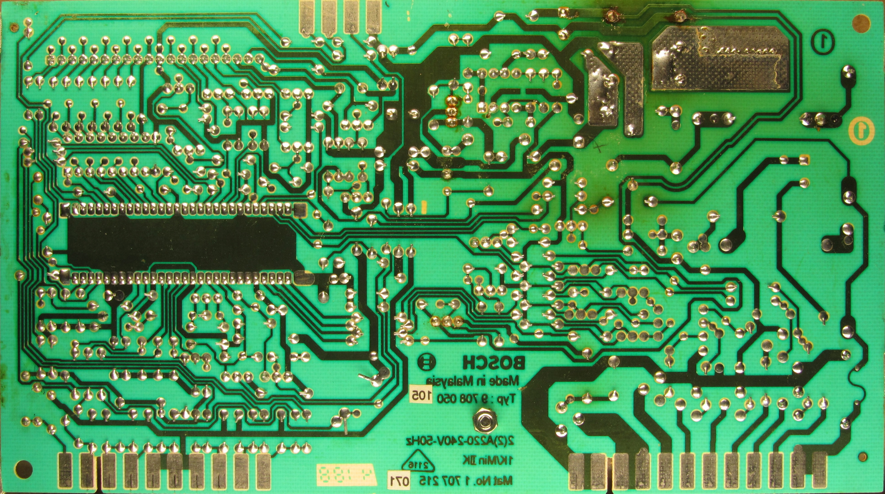
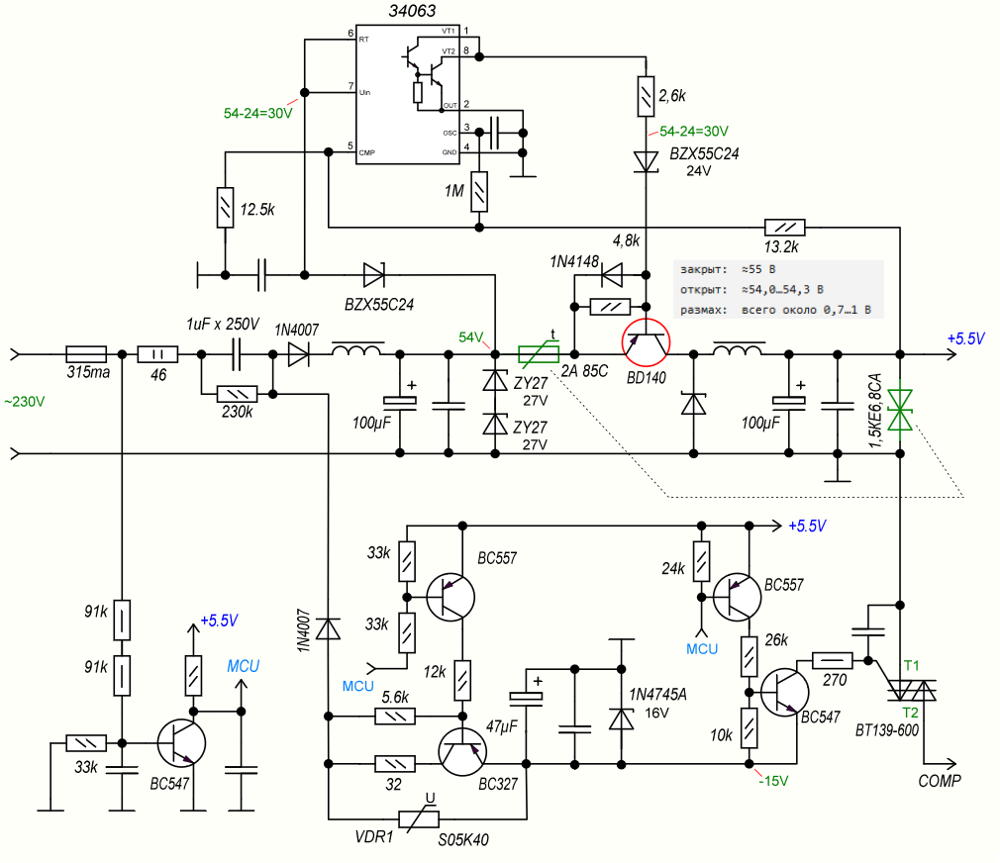
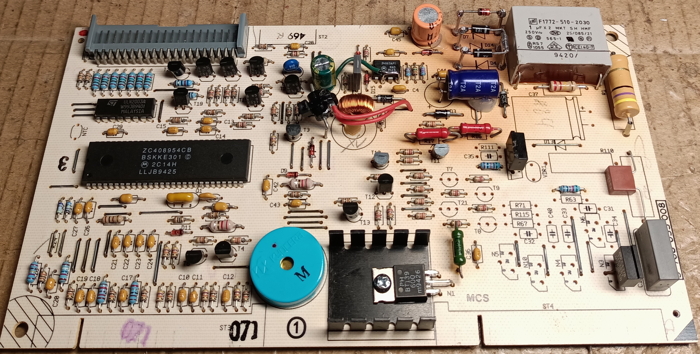
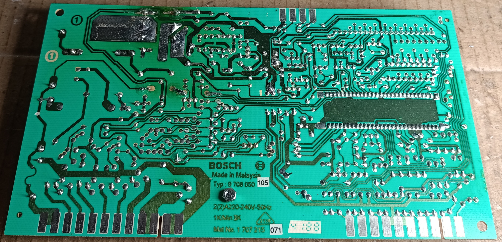
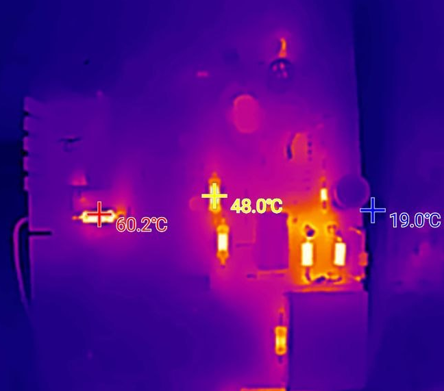
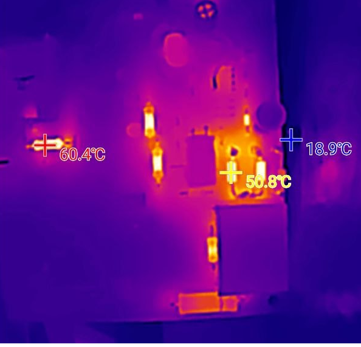

# Ремонт блока питания холодильника Bosch 1994 года

Этот каталог содержит фотографии, материалы реверс-инжиниринга и описание ремонта электронной платы холодильника Bosch 1994 года выпуска.

Плата проработала около 32 лет. Основной причиной неисправности стали высохшие электролитические конденсаторы и длительный локальный перегрев отдельных элементов, из-за которого плата потемнела, а часть печатных проводников начала отслаиваться.

## Исходное состояние платы

### `IMG_1340_adj-1.jpg`

Вид электронной платы со стороны элементов.

### `IMG_1340_adj-2.jpg`

Вид платы со стороны пайки.

Эти же два изображения используются как подложки для реверса печатной платы в Sprint-Layout. По ним восстанавливались расположение элементов, соединения печатных проводников и общая структура схемы.

## Восстановленная схема

### `sch_ac-dc.png`

Фрагмент восстановленной схемы электронной платы — источник питания.

Сама схема выполнена в sPlan, а PNG-файл добавлен для быстрого просмотра и использования в качестве превью.

Описание принципа работы схемы находится в отдельном файле:

- [`power_supply.md`](power_supply.md)

## Выполненный ремонт

В ходе ремонта были выполнены следующие работы:

- заменены все три электролитических конденсатора, высохшие за 32 года эксплуатации;
- наиболее горячие элементы подняты над поверхностью платы для уменьшения локального нагрева текстолита;
- три сильно нагревающихся резистора заменены на резисторы мощностью 0,5 Вт;
- на выходе источника `+5,5 В` добавлена защита на TVS-супрессоре;
- в цепь защиты добавлен термопредохранитель.

### `pcb_mod_face-2.jpg`

Вид платы со стороны элементов после ремонта и установки дополнительных защитных компонентов.

### `pcb_mod_back-1.jpg`

Обратная сторона платы после ремонта.

На фотографии видна фиксация загнутых выводов заменённых элементов суперклеем. Такое решение применено из-за отслоения части печатных проводников, вызванного многолетним нагревом платы.

## Тепловой контроль

### `heat-map-1.png`

Тепловое изображение платы, сделанное PIR-камерой. На снимке видны наиболее горячие элементы и их температура.

### `heat-map-2.png`

Второе тепловое изображение платы после включения. Используется для оценки распределения температуры и поиска наиболее нагруженных элементов.

## Предупреждение по безопасности

В блоке питания используется бестрансформаторная схема с ёмкостным балластом. Гальваническая развязка от сети отсутствует, поэтому общий провод платы и низковольтные цепи могут находиться под опасным сетевым потенциалом относительно земли.

Проверку и измерения следует выполнять только с соблюдением требований электробезопасности, желательно через разделительный трансформатор.
