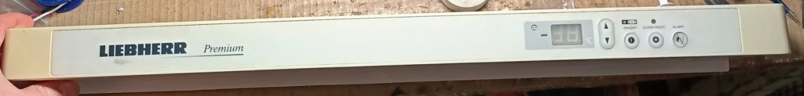
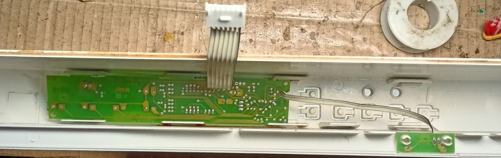
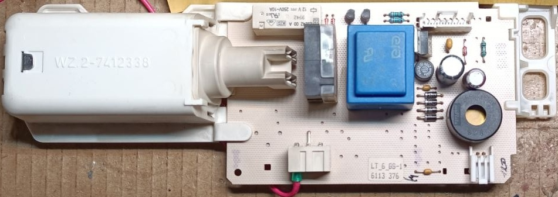
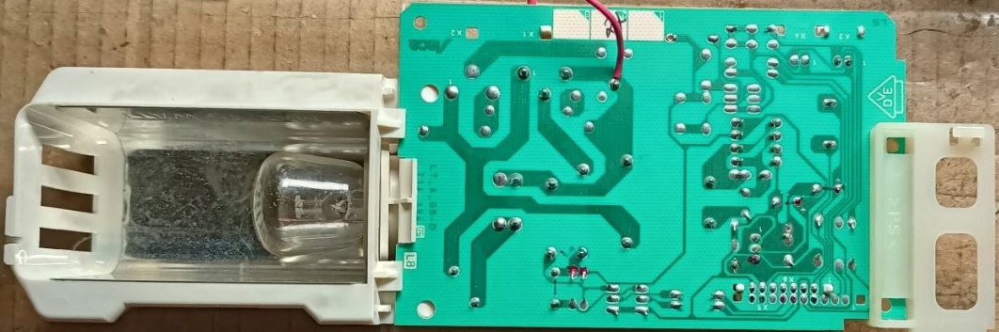
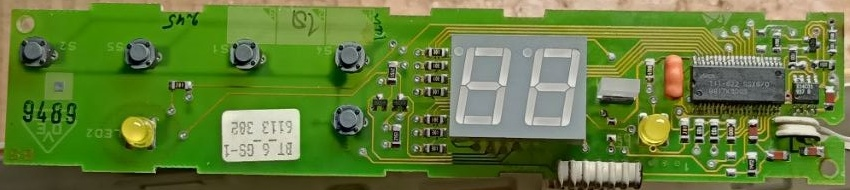
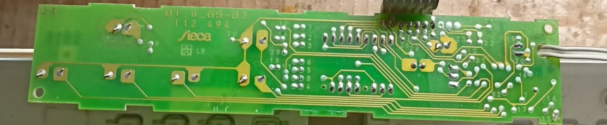
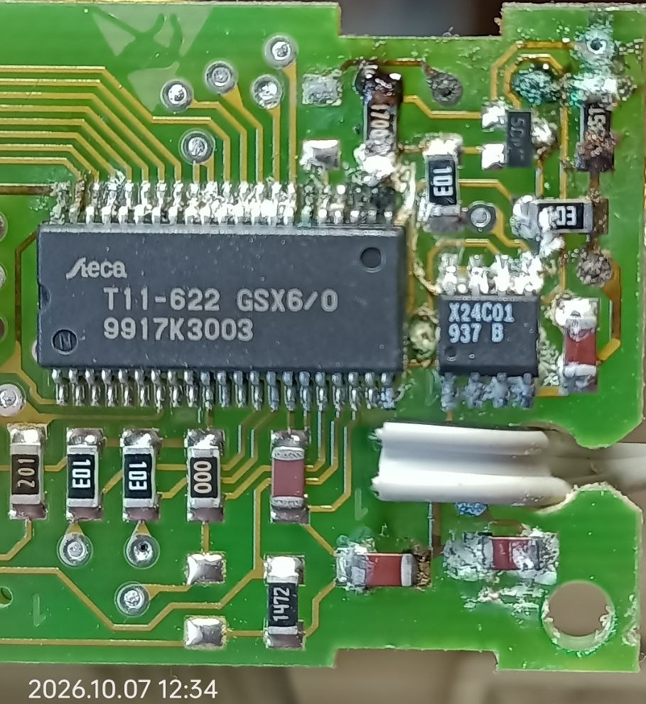
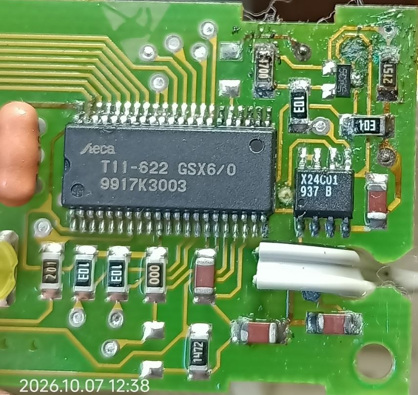
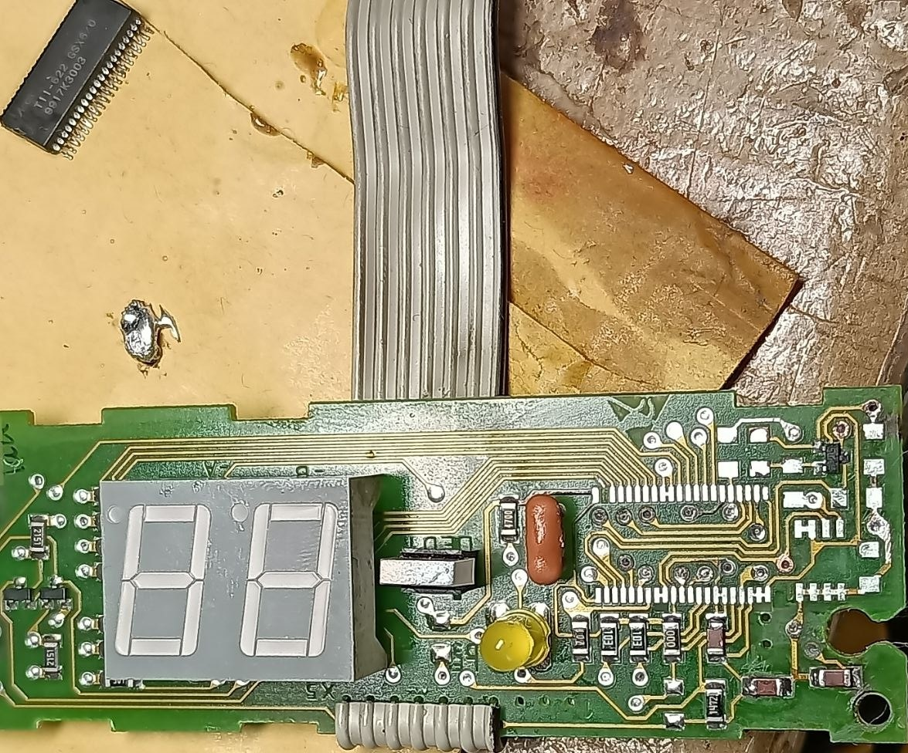
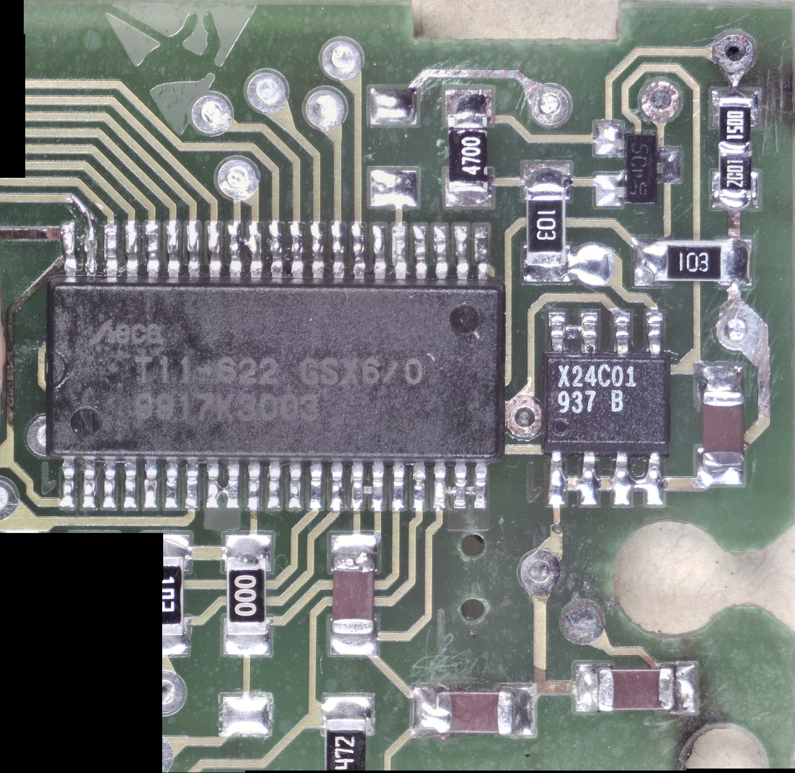

# История одного (очередного) ремонта: плата холодильника

Принесли мне плату холодильника. Говорят, ничего не работает: свет всё время горит, компрессор не включается...

Принесли вместе с панелью, в сборе.

Видимо, чтобы не разбирать, потому что состоит этот модуль из двух плат, соединённых шлейфом. На силовой части - пара реле: одно для лампочки, другое, видимо, для компрессора. Там же блок питания, собранный на трансформаторе и 7805, и пищалка.

Остальное - на плате передней панели: контроллер, индикатор и кнопки. Плата эта надёжно так вхерячена под три защёлки... Я на всё это посмотрел и тоже решил, что вытаскивать её пока не буду. Потом, конечно, пришлось.

Ну, включаю я, значит, как обычно, всю эту ерунду к своему лабораторному комплексу - там есть выход с развязывающим трансом и предохранителем. Ещё и через последовательную лампочку, на всякий случай...

И схема действительно ведёт себя ровно так, как описали.

Начинаю мерить питание - стандартный первый шаг. Вроде всё нормально, 5 В есть. Конденсаторы на вид нормальные, но тоже проверил. Подкинул на базы транзисторов через резик 5 В - реле клацают. Значит, и тут всё работает...

Странно, думаю.

Ладно, выключаю, подключаю переднюю панель, включаю... И каким-то чудом плата запускается! Я даже видео снял, отправляю заказчику: мол, хз, всё вроде работает. Может, думаю, какой-то контакт в разъёме шлейфа был окисленный, а после переподключения ожил.

Проверил разъём шлейфа, прозвонил - вроде всё ок.

Ладно, думаю, попробую ещё раз. Включаю... И тут всё: снова не работает и ведёт себя ровно так, как описал заказчик.

Ну что, делать нечего, придётся выдёргивать плату передней панели. С помощью щупов от мультиметра :D поотгибал все зацепы. Щупы подошли по своей утолщающейся форме - как раз удобно было вставлять их в зазоры и удерживать защёлки отогнутыми. Потом крючком поднял плату.

И, блин, вижу я на ней вот это:

То ли остатки флюса, то ли хз что. Но, по-видимому, там уже пошла коррозия, а вся эта гадость с солями начала создавать утечки между ногами MCU, и он перестал нормально запускаться. Во всяком случае, выглядело это весьма подозрительно.

Начинаю мыть изопропиловым спиртом, но вижу, что нихрена он толком не растворяет эту хрень. Только частично - на следующем фото видно, что стало чуть чище.

Ладно, беру ацетон «Ноготок». Стало получше, но пайка окислена так, что паяльником заново не пропаивается. Попробовал на пострадавших резисторах - нормально залудить не получается.

Отмыл как мог, включаю и... вообще тишина.

Ладно, думаю, придётся по ходу действовать радикально. Сдул в этой области всё, что было: MCU, какую-то микру рядом в восьминогом корпусе - может, это полевик - и все резисторы. Снял весь припой губкой, снова всё вымыл.

Ставлю микры обратно. Резисторы все заменил, потому что после этой коррозии хз, насколько живы контактные площадки на самих резиках.

Особенно пострадал резистор на 2,15 кОм, который там с краю, в углу. Попробовал на нём аккуратно почистить контактные площадки. Ну и как только прикоснулся к одной из них, она просто отпала...

По закону Мёрфи у меня ещё и нет такого номинала. А там резистор с допуском 1 %, то есть просто поставить 2,2 кОм - уже выйти за этот допуск. Может, конечно, и можно было бы, но я в этот раз схему не рисовал и не разбирался, как там всё устроено. Поэтому решил оставить номинал как был.

Ладно, место есть. Собрал эти 2,15 кОм из двух резисторов 0805, последовательно: 2 кОм + 150 Ом. Благо у меня есть кассетница с резисторами, и они как раз с допуском 1 %.

Ну что, включаю - работает. Прекрасно. Звоню заказчику сообщить хорошую новость.

Ну и напоследок посмотрел под микроскопом пайку MCU, бо мало ли...

