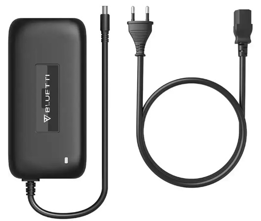
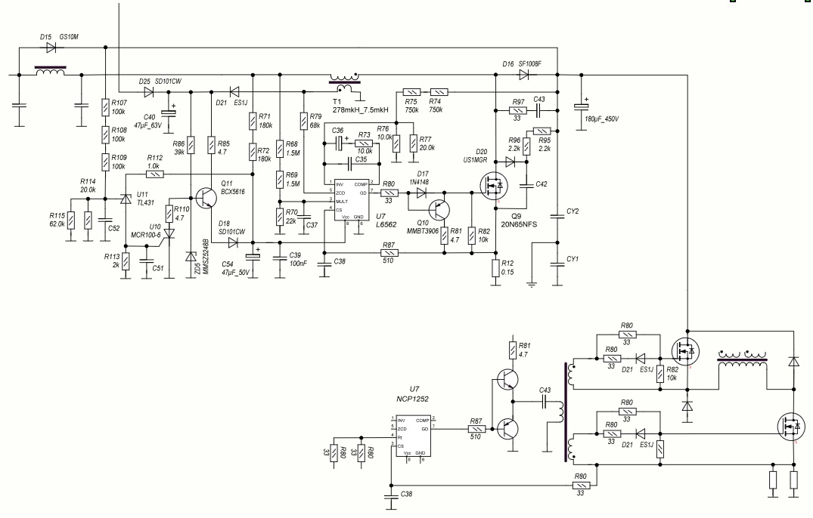

# Bluetti T200 charger – APFC reverse engineering

Reverse-engineering project for the **Bluetti T200 AC charger**,  
used with portable power stations such as **EB3A / EB55 / EB70** (and similar models).

This project currently focuses on the **APFC (Active Power Factor Correction)** stage only.

---

## Story / motivation

This T200 brick was bought second-hand as **“not working”** – perfect candidate for:

- a spare charger for Bluetti stations, and
- an excuse to look inside yet another SMPS.

The actual failure was delightfully boring:

- judging by the marks, the charger was most likely **dropped**;
- on one of the wound parts (APFC inductor or main transformer – it’s been a while),  
  an **auxiliary winding** had broken off;
- the core and bobbin were intact, but the **thin magnet wire snapped** right where it left the winding.

So the “repair” was essentially:

- find the broken end,
- restore the contact,
- no rewinding, no core disassembly, just some careful soldering and insulation.

Of course, after that it was impossible *not* to peek at how the APFC was done.  
Time was limited, though, so for now only the **APFC section** made it into a schematic –  
which, unsurprisingly, is very close to the **datasheet application circuit** for the PFC controller IC,  
with some minor tweaks from Bluetti / OEM.

What exists is what gets published here – the rest can be added later as time allows.

---

## Device identification

External view of the charger for visual identification:

[](./_img/device.jpg)

This should help you confirm that you have the **same T200 brick** (or a very close relative).

---

## Schematic (APFC section)

- `sch_T200.spl8`  
  Reverse-drawn **APFC schematic** in **sPlan 8** format.  
  > Scope: the **PFC front-end only** (boost stage + control) up to the high-voltage DC bus.  
  > Status: **usable**, but not a fully polished, entire-charger schematic.

Design notes:

- Topology is a fairly standard **boost PFC**:
  - mains input → rectifier → boost inductor → PFC switch → bulk capacitor (HV DC bus),
  - driven by a dedicated PFC controller IC.
- The schematic closely follows the **reference design** from the controller datasheet:
  - same basic pinout and feedback structure,
  - vendor-specific tweaks in values, protection margins, and EMI/network filtering.

### Schematic preview (image)

For quick viewing without sPlan, there is a full-size JPEG export:

[](./sch_overview.jpg)

> This image is provided **for preview only** and may lag slightly behind  
> the `sch_T200.spl8` project in terms of small corrections or annotations.  
> The sPlan file should be considered the primary, most up-to-date source.

---

## Project layout

```text
ps_Bluetti_T200/
  _img/
    device.jpg                 – external view of the Bluetti T200 charger

  sch_T200.spl8                – APFC (PFC front-end) schematic in sPlan 8
  sch_overview.jpg             – full-size JPEG preview of the APFC schematic

  README.md                    – this file
```

## Status

Current reverse-engineering progress:

- 🟡 **APFC schematic (`sch_T200.spl8`)** – captured and readable  
  - main boost PFC topology and controller connections are in place,  
  - component values and some minor details may still be refined.
- 🔘 **Main PWM / DC output stage** – **not yet drawn** (only inspected visually).
- 🔘 **Complete “from mains to DC plug” schematic** – planned, but not started.

If you have another revision of the T200 (or a similar Bluetti charger) and want to help:

- high-resolution photos of the PCB (both sides),
- controller IC markings and any differences in the PFC network,
- measurements / notes from your unit

are all very welcome.
