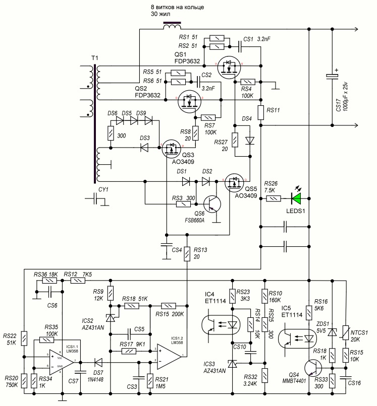
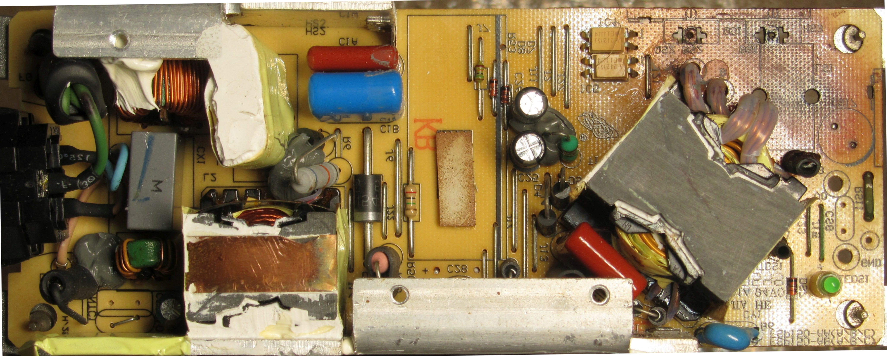

# FSP150-AGB 15 V / 10 A PSU – DC-side reverse engineering

Reverse-engineering project for a **15 V / 10 A switching power supply**  
(model **FSP150-AGB**), adopted as a potential charger / DC source for a power station.

## Story / motivation

This unit was bought on a local classifieds site as **“15 V, 10 A PSU, not working, cheap”**.  
Perfect candidate for a future charger and for some forensic electronics.

After opening the case it quickly became obvious what happened:

- HOT (primary) side: visually fine, nothing exploded, no obvious trauma.
- DC (secondary) side: something had a *very* bad day:
  - the **output toroidal inductor** got hot enough to char the surrounding PCB area,
  - the **output capacitor** on the 15 V rail had self-destructed,
  - the inductor core itself **crumbled**.

Naturally, that made the secondary side interesting to reverse-engineer.  
Especially because:

- the supply uses a **synchronous rectifier** on the secondary
- **without** a dedicated controller/dedicated driver IC,
- and combines that with **current, voltage and temperature protection** implemented around it.

Given the amount of carbonized PCB, we can safely say that **the thermal protection did not quite save the day**.  
The NTC / thermal sensor is placed “nearby” but *not* at the hottest spot of the output filter…

---

## Scope of reverse engineering (so far)

At this stage the work focuses on the **low-voltage DC side**:

- synchronous rectifier topology and gate drive,
- output LC filter,
- current sense and limiting,
- voltage feedback and references,
- temperature sensing and shutdown logic.

The **primary (HOT) side** is currently only inspected visually and **not yet drawn** in the schematic.  
The PWM controller, primary MOSFETs, and any PFC stages remain “to be mapped later”.

---

## Schematic

- `sch.spl8`  
  Reverse-drawn schematic of the **DC / secondary side** in **sPlan 8** format.  
  > Status: ~**50–60% complete** – the main DC topology is captured  
  > (sync rectifier, output filter, protection blocks),  
  > with some details and component values still being verified against the real board.

### Schematic preview (image)

For quick viewing without sPlan there is a JPEG export of the DC side:

[](./sch_lo_overview.jpg)

> This image is provided **for preview only** and may lag behind the  
> `sch.spl8` source project in terms of completeness and minor corrections.  
> The sPlan file should be treated as the primary, most up-to-date reference.

---

## Microscope photos – component & net identification

The `micro/` folder contains microscope images used to identify SMD components and trace critical nets:

- `micro/HI-P.png` – high-power / high-current output region  
  (inductor, output MOSFETs/diodes, heavy copper traces).
- `micro/LO-P.png` – low-potential / sensing region  
  (current shunt, op-amps, logic around protections).

They are useful for:

- reading tiny **SMD markings**,
- confirming **which pad connects where** when building the schematic,
- double-checking that the drawn nets actually match the copper on the board.

---

## PCB & visual gallery

A couple of “normal” board photos for identification and orientation.

| | |
|---|---|
| [](./pcb/IMG_1231_FV4.jpg) | [](./pcb/IMG_1224_FV_FH.jpg) |

- **Top side (`IMG_1231_FV4.jpg`)** – general view of:
  - output filter area (the tragic ex-inductor and cap removed),
  - heatsinks removed,
  - connectors and low-voltage section.
- **Bottom side (`IMG_1224_FV_FH.jpg`)** – overview of:
  - power and signal routing,
  - polygon pours,
  - any suspicious darkened zones from overheating.

These photos help to:

- identify whether your board revision matches this project,
- quickly locate sections referenced in the schematic,
- plan measurements and rework without constantly opening the case.

---

## Project layout

```text
ps_FSP150-AGB_15v10a/
  sch.spl8                     – DC-side schematic in sPlan 8 (WIP, ~50–60%)
  sch_lo_overview.jpg          – JPEG preview of the DC-side schematic

  micro/
    HI-P.png                   – microscope image, high-current / high-power region
    LO-P.png                   – microscope image, low-potential / sensing region

  pcb/
    IMG_1231_FV4.jpg           – PCB top side (overall view)
    IMG_1224_FV_FH.jpg         – PCB bottom side (overall view)

  README.md                    – this file
```

## Status

Current reverse-engineering progress:

- 🟡 **DC-side schematic (`sch.spl8`)** – ~50–60%  
  - synchronous rectifier, output filtering, and protection logic mostly captured,  
  - some values, reference designators and connections to the primary are still being refined.
- 🔘 **Primary (HOT) side** – not yet drawn, only visual inspection.
- 🔘 **Notes / commentary** – to be expanded once the unit is repaired and tested under load.

Contributions are welcome:

- better/cleaner photos,
- oscilloscope captures of gate drive / current sense,
- notes from other FSP150-AGB revisions or similar FSP designs.
