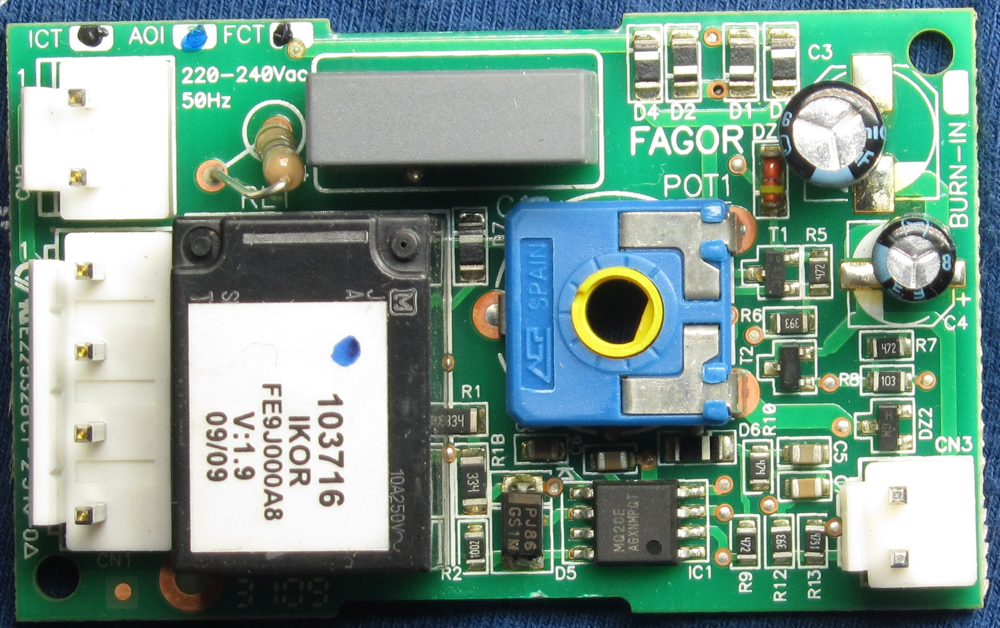
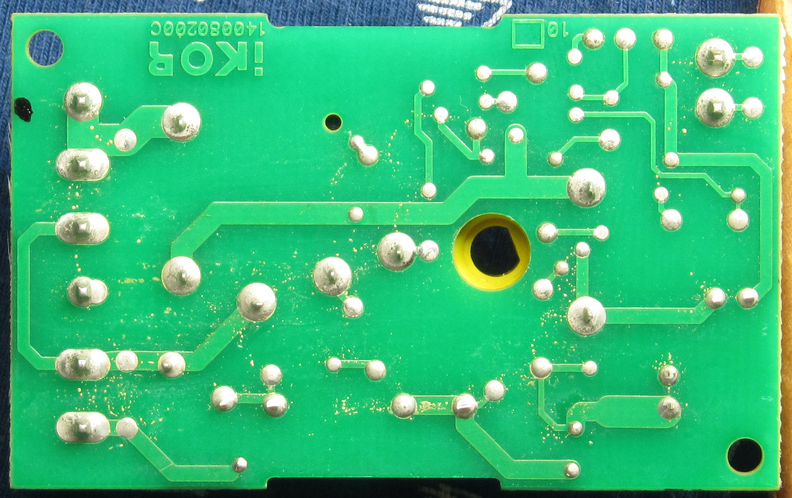
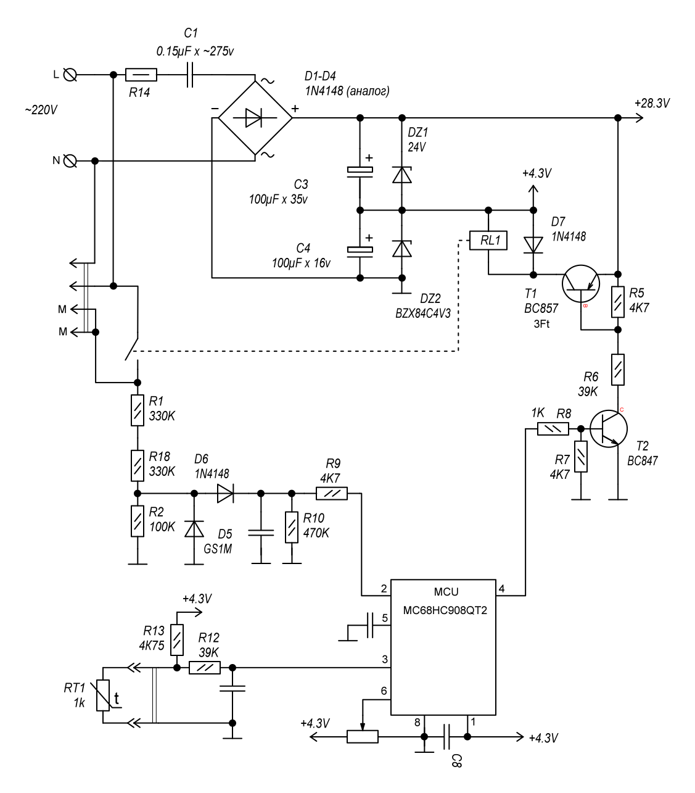

# Ремонт электронного терморегулятора холодильника

Очередная небольшая история ремонта. Принесли электронный терморегулятор от какого-то холодильника с просьбой посмотреть, почему он не работает.

Точная модель холодильника и самого регулятора мне неизвестна, поэтому ремонт фактически выполнялся по самой плате, с параллельным восстановлением её принципиальной схемы.

## Исходные материалы

Фото платы с установленными компонентами:



Обратная сторона:



Плату я предварительно отфотографировал, чтобы затем использовать фотографии как подложку в Sprint Layout и по дорожкам восстановить соединения.

В результате получилась следующая схема:



## Первичная диагностика

По схеме видно, что устройство питается непосредственно от сети через **бестрансформаторный источник питания с балластным конденсатором**.

После выпрямителя питание организовано несколько интереснее, чем в виде двух независимых шин относительно общего минуса.

Нижняя секция формирует около **4.2 В** для питания микроконтроллера, а 24-вольтовая секция для реле включена **поверх неё**. Поэтому верхняя точка источника имеет относительно минуса моста примерно **28 В**, а катушка реле подключена между этой верхней точкой и шиной `+4.2 В`, то есть непосредственно на ней получается около **24 В**.

Изначально номиналы этих напряжений мне известны не были.

Наклейку с реле сразу срывать не хотелось, поэтому о том, что катушка рассчитана на 24 В, я узнал несколько позже. С питанием микроконтроллера ситуация была похожей: согласно datasheet он мог работать как от 3.3 В, так и от 5 В.

Дополнительную неопределённость создавал SMD-стабилитрон в корпусе SOT-23 с маркировкой `W9`. Однозначно определить его тип по маркировке не получилось, а при проверке тестером он выглядел примерно как стабилитрон на 3.7–4 В.


## Особенность организации питания

Возможно, для подобных бытовых устройств это вполне типовое решение, но без опыта ремонта таких схем оно не обязательно сразу очевидно.

Как уже отмечено выше, здесь нет двух независимых источников `+4.2 В` и `+24 В`, каждый из которых отсчитывается от минуса диодного моста.

Секции питания включены последовательно:

- нижний стабилитрон формирует около **4.2 В** относительно минуса моста;
- верхний стабилитрон формирует ещё около **24 В**, но уже относительно шины `+4.2 В`.

В результате верхняя точка питания относительно минуса моста находится примерно на уровне:

```text
4.2 В + 24 В ≈ 28.2 В
```

Катушка реле включена не между верхней шиной и минусом моста, а между верхней шиной и точкой `+4.2 В`, поэтому напряжение непосредственно на катушке составляет:

```text
28.2 В - 4.2 В ≈ 24 В
```

Такое решение позволяет от одного бестрансформаторного источника с балластным конденсатором получить два необходимых напряжения с минимальным количеством компонентов. Для маломощной схемы, где доступный ток и без того ограничен реактивным сопротивлением балластного конденсатора, это вполне рациональный вариант.

Есть и практический момент для диагностики: **24 В здесь нужно измерять относительно шины `+4.2 В`, а не относительно минуса моста**. Если измерять верхнюю точку относительно минуса, исправная схема должна показать уже около **28 В**.

> Важно: обозначения `0 В`, `+4.2 В` и `+28 В` здесь являются только внутренними потенциалами схемы. Блок питания бестрансформаторный и гальванической развязки от сети не имеет, поэтому вся «низковольтная» часть платы потенциально опасна относительно земли.

Измерение напряжений на фильтрующих конденсаторах `C3` и `C4` показало следующее:

- низковольтное питание микроконтроллера практически отсутствует;
- на 24-вольтовой секции вместо ожидаемых впоследствии 24 В присутствует всего около **12 В**.

Начался поиск виновника.

## Проверка стабилитрона

Первым подозреваемым после конденсаторов стал стабилитрон низковольтной ветки.

Я выпаял его и подключил через резистор **1 кОм** к лабораторному источнику питания.

При входном напряжении порядка 10–13 В стабилитрон нормально работал и удерживал напряжение примерно на:

**4.2 В**

То есть с ним всё оказалось в порядке.

## Проверка на короткое замыкание

Следующей версией было чрезмерное потребление по низковольтному питанию.

Это особенно существенно для конденсаторного блока питания: при ёмкости балластного конденсатора порядка **0.15 µF** доступный ток составляет всего примерно 10 мА.

Короткого замыкания на линии питания обнаружено не было.

Тем не менее я выпаял MCU как наиболее сложный компонент, который в случае внутреннего повреждения потенциально мог сильно нагрузить источник питания.

После удаления микроконтроллера ситуация никак не изменилась.

Раз уж MCU был выпаян, обратно устанавливать его до окончания разбирательств с питанием я не стал — от греха подальше.

## Балластный конденсатор

Следующим очевидным подозреваемым был входной балластный конденсатор.

Его ёмкость была проверена и выглядела нормальной.

Для полной уверенности я даже заменил его новым.

Результат — без изменений.

Напряжения питания по-прежнему были неправильными.

## Проверка обеих веток питания отдельно

После этого я решил проверить всю низковольтную часть независимо от сетевого конденсаторного БП.

Напряжение подавалось непосредственно на плюсы `C3` и `C4` от лабораторного источника через последовательный резистор **1 кОм**.

Для одной ветки подавалось примерно **10–15 В**, для второй — **20–30 В**.

Результат:

- короткого замыкания нет;
- стабилитроны работают;
- нижняя секция стабилизируется примерно на **4.2 В**;
- верхняя секция удерживает примерно **24 В относительно шины +4.2 В**.

Таким образом стало понятно, что вся часть схемы **после выпрямителя исправна**.

А поскольку к этому моменту были фактически проверены уже все элементы блока питания, кроме диодного моста, подозрение наконец пало на него.

## Замена диодного моста

Какие именно диоды использовались в оригинале, мне неизвестно.

Я заменил четыре SMD-диода моста на обычные **1N4148 в SMD-корпусах**.

Включаю плату — и вуаля:

**оба напряжения появились.**

Низковольтная секция — около 4.2 В, а на секции питания реле — около 24 В. Соответственно верхняя точка источника относительно минуса моста находится примерно на уровне 28 В.

Причина неисправности была найдена.

После этого MCU был установлен обратно, плата отмыта от остатков флюса, и ремонт на этом можно было считать законченным.

## Но какой именно диод был неисправен?

После ремонта мне стало интересно, что же конкретно произошло со старыми диодами.

Обычная проверка мультиметром никакой неисправности не показывала.

Все четыре диода выглядели совершенно нормальными:

- в прямом направлении — падение около **0.6 В**;
- в обратном направлении — обрыв.

То есть стандартный `diode test` утверждал, что все диоды исправны.

Возникло предположение, что напряжение обычного режима проверки слишком мало и дефект перехода при таких условиях просто не проявляется.

У моего мультиметра есть отдельный режим проверки стабилитронов. В нём прибор способен создавать напряжение до **24 В** при небольшом токе.

Я проверил выпаянные диоды ещё раз уже в этом режиме.

И тут всё стало очевидно.

Три диода в обратном направлении по-прежнему показывали обрыв.

А вот **четвёртый диод при обратном включении начинал проводить**, причём мультиметр показывал напряжение примерно:

**5 В**

То есть неисправный диод фактически превратился в своеобразный **стабилитрон примерно на 5 В**.

При низковольтной проверке этого совершенно не было видно, но в реальной схеме, где обратное напряжение на диодах значительно выше, дефект проявлялся и нарушал работу выпрямителя.

## Итог

В результате неисправность оказалась довольно интересной:

> Один из диодов сетевого выпрямителя имел нормальный прямой переход и выглядел полностью исправным при стандартной проверке мультиметром, но при повышенном обратном напряжении начинал проводить примерно с 5 В.

Из-за этого диодный мост формально продолжал как-то работать, однако конденсаторный источник питания уже не мог обеспечить нормальные напряжения:

- секция питания MCU практически не работала;
- вместо 24 В на секции питания реле получалось около 12 В.

Замена диодов полностью восстановила работу устройства.

### Небольшой вывод

Обычная проверка диода мультиметром отвечает только на довольно ограниченный вопрос: **как ведёт себя переход при том небольшом напряжении и токе, которые предоставляет тестер**.

Она вовсе не гарантирует, что диод сохраняет нормальные свойства при реальном рабочем обратном напряжении.

В данном случае именно проверка повышенным напряжением позволила найти дефект, который совершенно не проявлялся в стандартном режиме `diode test`.