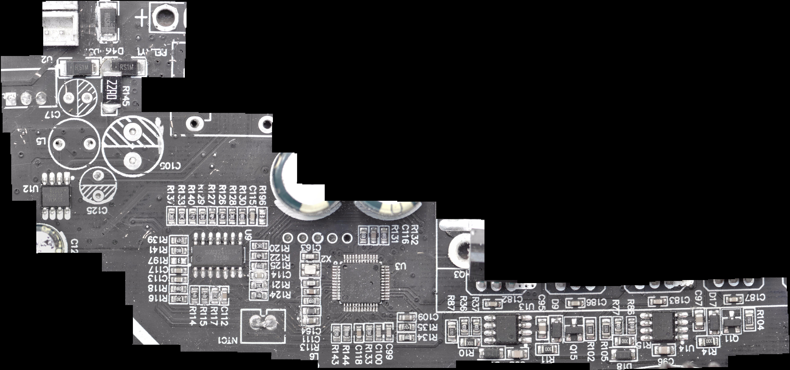
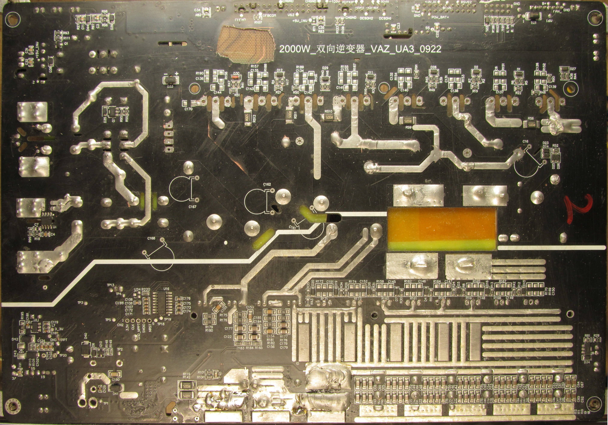
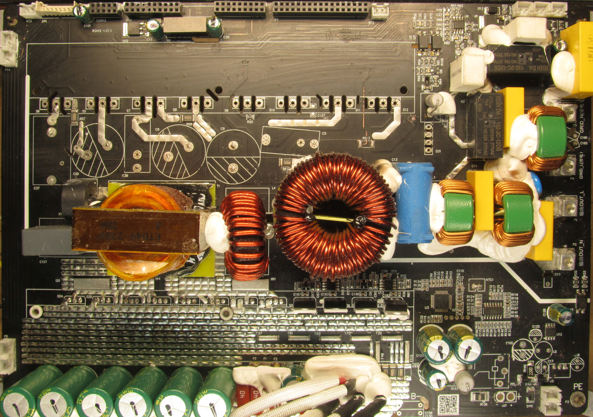
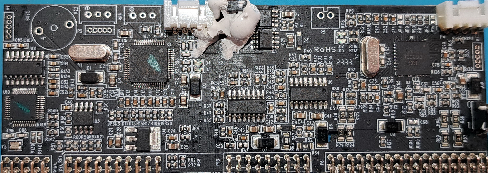
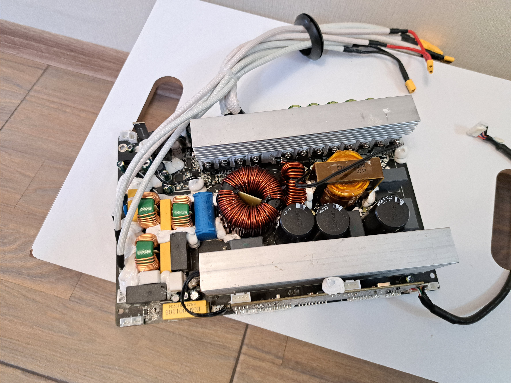
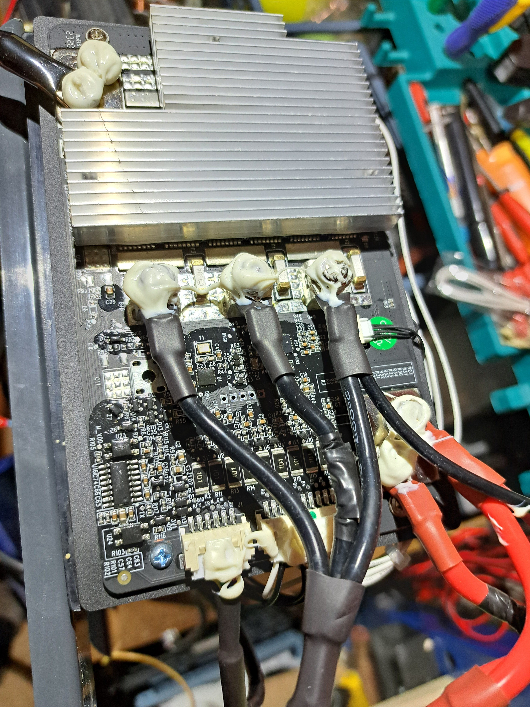

# APower 2K UPS / Inverter Reverse Engineering

This directory contains work-in-progress reverse-engineering notes for an APower 2K UPS/inverter.

At the moment, the main useful artifact is a manually reconstructed inverter schematic. The **sPlan 8** version is the primary working file, while an **SVG** export is kept synchronized with it for convenient viewing:

- `inv_1615.spl8` — primary editable schematic;
- `inv_1615.svg` — SVG version for direct viewing.

The schematic was traced manually, so it may contain mistakes and should not be treated as a verified reference. It is also still incomplete: not every part of the circuit has been traced in the same level of detail, and not all component reference designators have been assigned yet.

The uneven level of detail is intentional and reflects the actual repair work performed on this particular unit. The **EG8026-based section** was the most heavily damaged part of the inverter: the controller itself, many surrounding SMD components, and several PCB traces had to be reconstructed or replaced. As a result, this part of the schematic is currently the most complete and detailed, since it was traced directly as part of the repair process.

The **EG1615-based section** was affected much less severely and, apart from the power switches, did not require the same degree of reconstruction. That part of the schematic was therefore traced mainly for completeness and has so far been a lower-priority reverse-engineering task.

Most of the inverter power stage appears to follow the reference designs for the **EG1615** and **EG8026** controllers quite closely.

A **Nation** microcontroller located on the power board appears to control the battery charger. This part is more interesting from the reverse-engineering perspective, since it does not appear to simply replicate a datasheet reference circuit.

The charger power stage uses a **four-switch full-bridge / synchronous buck-boost topology**, so in principle it can operate with the input voltage either above or below the battery voltage.

There is another Nation MCU on the board containing the EG1615 and EG8026. Its exact role has not yet been investigated.

The unit arrived in very poor condition after an apparently unsuccessful previous repair attempt. The power stage was heavily damaged, including:

- all major power switches;
- several PCB traces;
- the EG8026 controller;
- part of the EG8026 surrounding circuitry.

## Repository Materials

In addition to the reconstructed schematic, the repository contains PCB photographs, configuration dumps, software utilities, and other supporting materials collected during the reverse-engineering work.

### PCB photographs

Photos of the particular unit used for this reverse-engineering work:

- [`pcb/micro/ctrl_board_micro.jpg`](pcb/micro/ctrl_board_micro.jpg) — control board, photographed under a microscope;
- [`pcb/micro/main_board_mcu_area.jpg`](pcb/micro/main_board_mcu_area.jpg) — part of the main board around the MCU and the control circuitry for the DC/SOLAR charger power bridge, photographed under a microscope;
- [`pcb/IMG_1303_C2.jpg`](pcb/IMG_1303_C2.jpg) — main inverter power board, back side. This image is used as a reference/template in Sprint-Layout while tracing the schematic;
- [`pcb/IMG_1305_C2.jpg`](pcb/IMG_1305_C2.jpg) — main inverter power board, component side. This image is also used as a reference/template in Sprint-Layout while tracing the schematic.

Additional reference photographs, not taken from my own unit:

- [`orig/ctrl_board.jpg`](orig/ctrl_board.jpg) — control board;
- [`orig/main_inv_board.jpg`](orig/main_inv_board.jpg) — overall perspective view of the main inverter board;
- [`orig/BMS.jpg`](orig/BMS.jpg) — BMS board.

The files under `orig/` listed above were obtained from the **gsm.in.ua** forum and are included as reference material.

### Software and firmware-related files

- `orig/Host_Software_EG1615_EG8026_Lite_V2.3.2.exe` — manufacturer utility for working with the EG1615 and EG8026 devices, including configuration/programming functions;
- `firmware/EG8026_APP.zip` — appears to contain manufacturer firmware/source code for the EG8026. This has **not been verified**; the archive was originally found on the **gsm.in.ua** forum.

### Configuration dumps

The repository also contains configuration-parameter dumps for the EG1615/EG8026-related devices:

- `config_dumps/stock/` — default/stock configuration dumps read from separately purchased devices;
- `config_dumps/apower2000/` — configuration dumps read from the APower 2000 unit.

The APower-specific configurations may differ from the stock defaults in parameters that affect actual operation, such as battery-voltage thresholds, power-calculation coefficients, and other calibration or protection-related values. For that reason, these dumps may be useful when comparing replacement devices or investigating behavior that cannot be explained by the external circuit alone.

The repository is still being organized and may be updated as the reverse-engineering work progresses.
