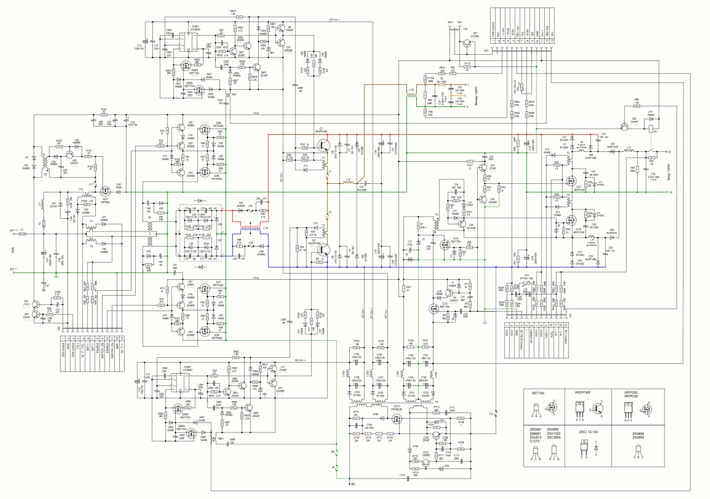
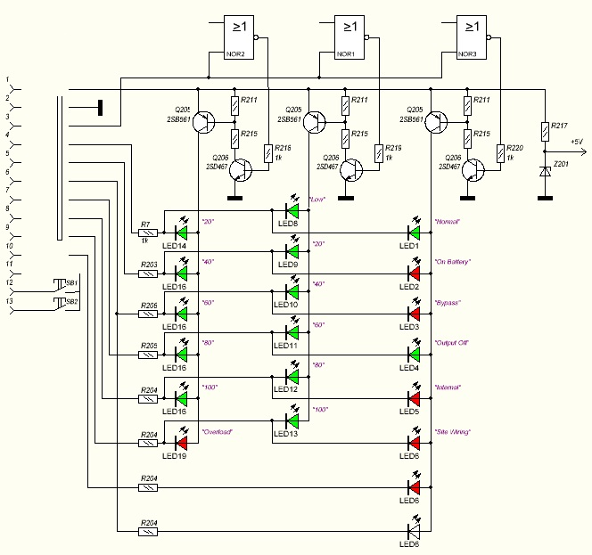
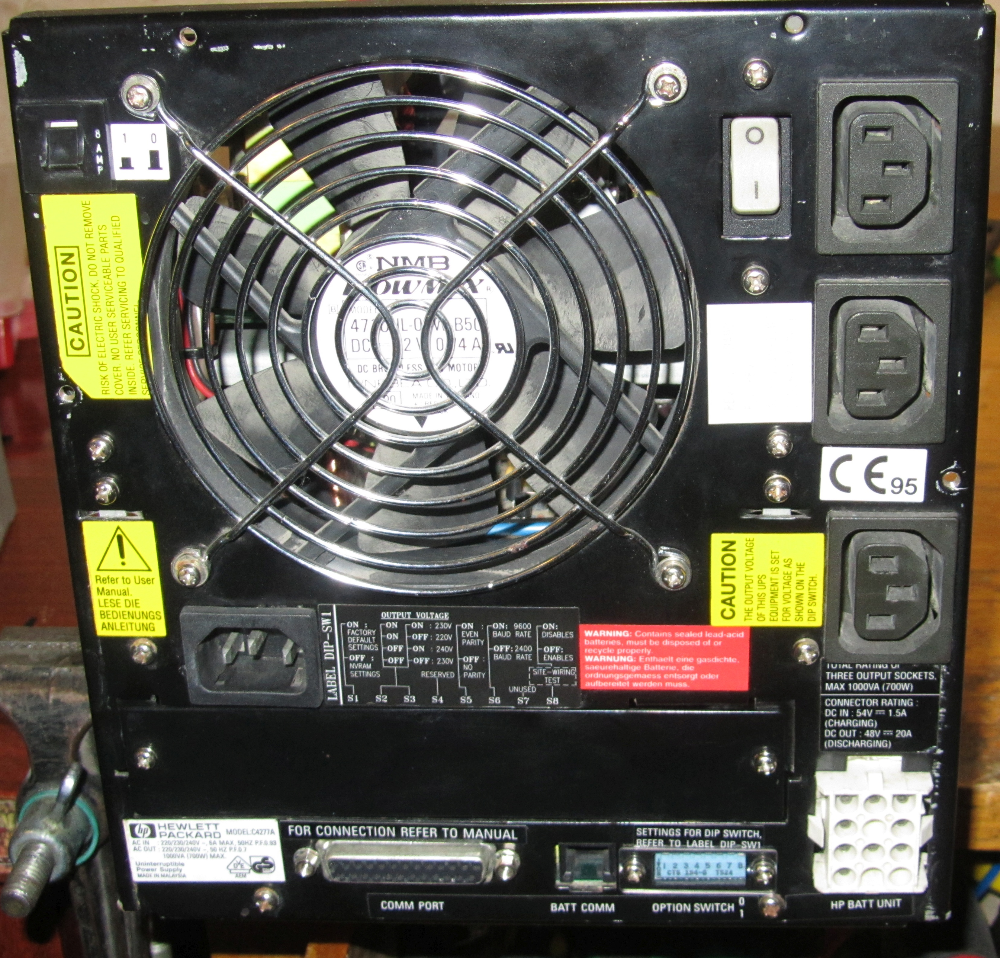
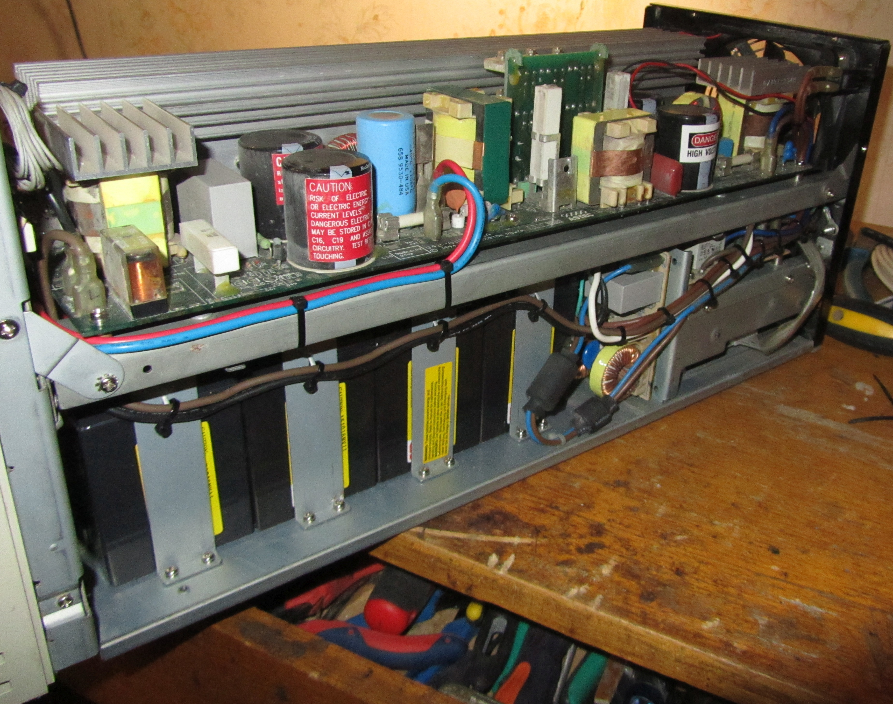
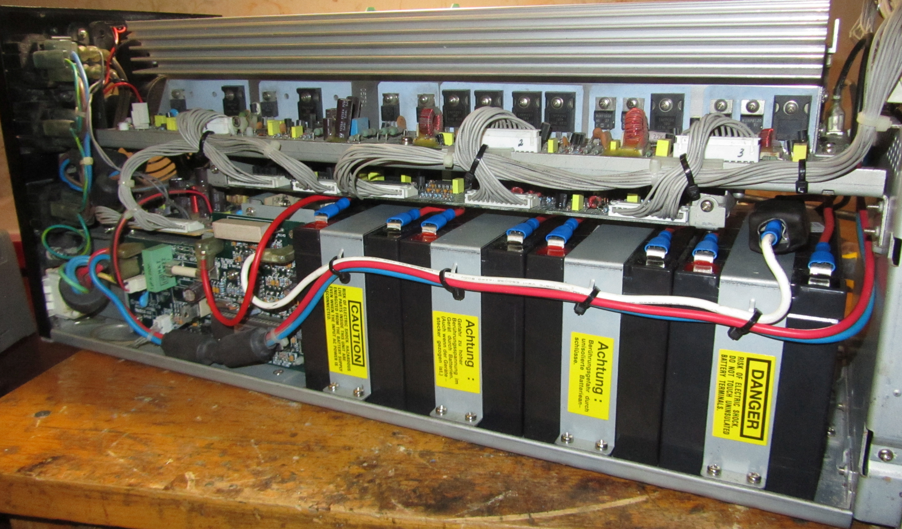
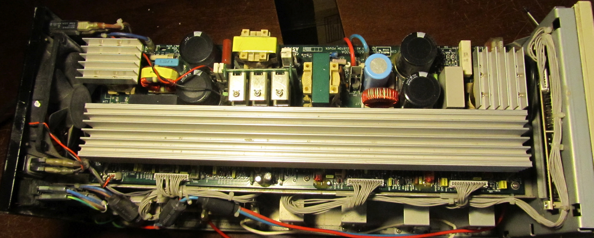
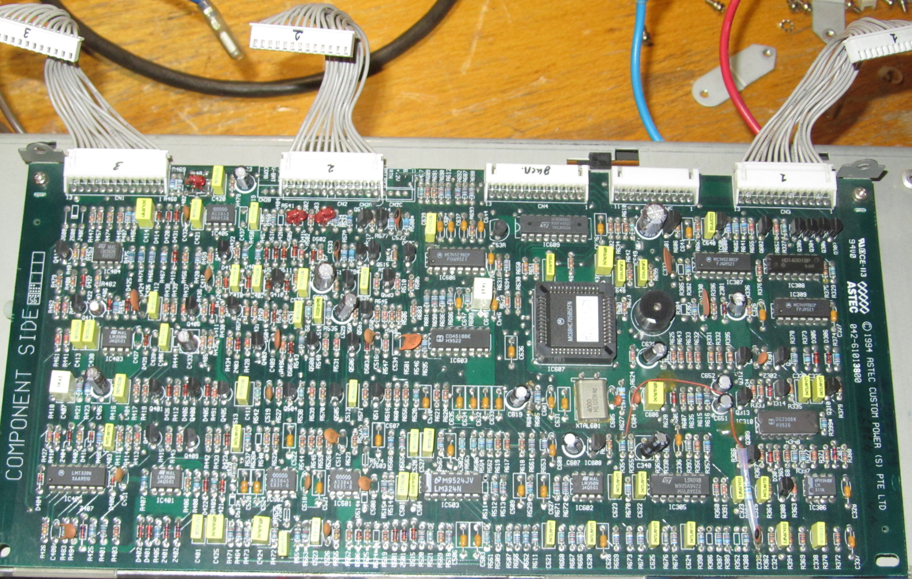
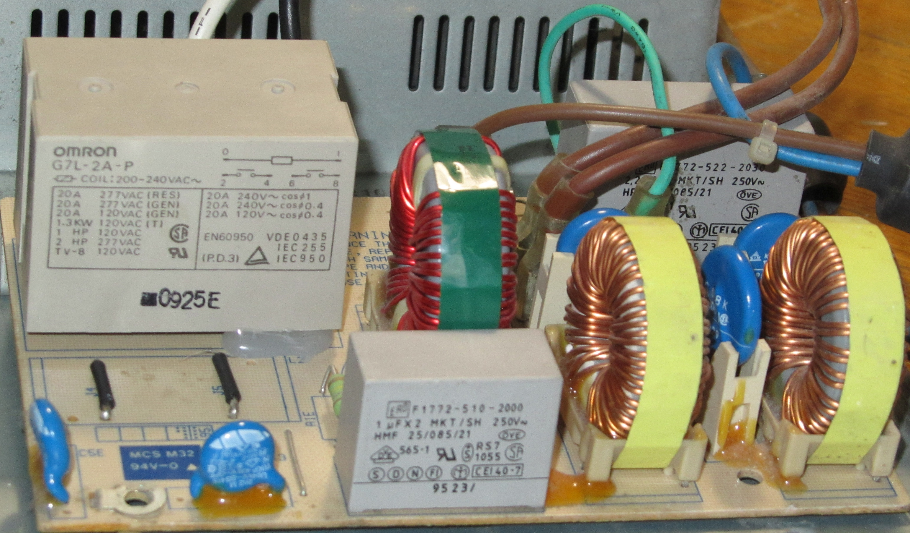
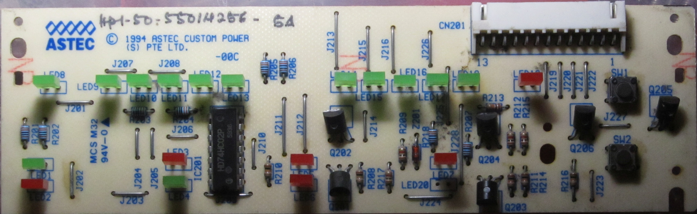
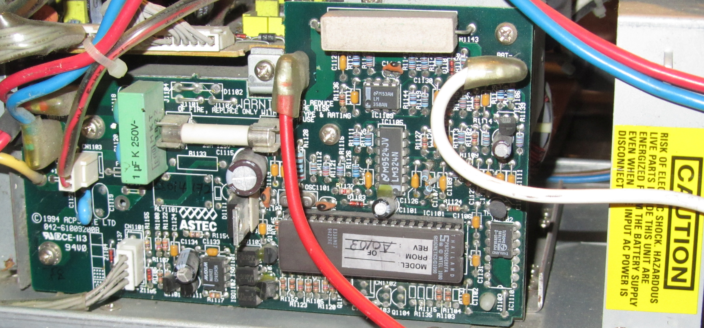

# HP PowerWise 1000 On-Line UPS – Reverse Engineering

Reverse-engineering project for the **HP PowerWise 1000** on-line (double-conversion) UPS.

This repository collects:

- Reverse-drawn **schematics** of the power board and LED/front-panel board
- Schematic previews in JPEG format for quick viewing
- Internal photos of the UPS: power board, control boards, filter board, LED board, etc.

The goal is to make **repair and study of HP PowerWise 1000** a bit easier and to give search engines something technical to index (e.g. *“HP PowerWise 1000 schematic”*, *“HP PowerWise 1000 UPS circuit diagram”*).

---

## Device overview

**Model:** HP PowerWise 1000  
**Type:** On-Line / Double-Conversion UPS  
**Power rating:** 1 kVA (nominal)

This repository currently focuses on:

- The **power board** (high-voltage DC-DC + DC-AC stages)
- The **LED / front panel board** (user interface)
- Visual documentation of different **control board** variants

There are **no PCB manufacturing files** here – only schematics and photos.

---

## Schematics

All schematics were drawn directly from the original boards.

### Power board

Files:

- `./schematics/power_board_ALL_IN_ONE.spl8`  
  Main **sPlan 8** project for the **power board schematic** (recommended, most up to date).

- `./schematics/power_board_ALL_IN_ONE.spl7`  
  Older **sPlan 7** version of the same schematic. Kept for compatibility with older sPlan installations.

- `./schematics/sch_overview_power_board.jpg`  
  JPEG **overview of the power board schematic** – just for preview.

  [](./schematics/sch_overview_power_board.jpg)

> Note: the JPEG overview may not always be perfectly in sync with the latest sPlan project.  
> The `.spl8` file should be treated as the **primary reference** for detailed work and updates.


**What this schematic covers**

The power-board schematic focuses on:

- High-voltage **DC-DC converter** (based on MOSFET **IRFP250**)
- High-voltage **DC-AC inverter** (IGBT **IRGPF30F**, driven by PWM controller of the 3843 family)
- Additional power section based on **IRFPC50**, with behavior similar to **APFC** (active PFC) – this interpretation is tentative
- Major inductors (**L13**, **L14**, **L16**) and high-power components

It **does not include**:

- Input/output EMI filters (separate PCB in the original UPS)
- Control board circuitry
- Detailed digital / logic control

The same schematic is also published here (original upload by the same author):

- **HP PowerWise 1000 On-Line UPS (power board) – Remont-AUD**  
  <https://remont-aud.net/load/drugaja_apparatura/vsjo_ostalnoe/hp_powerwise_1000_on_line_ups_power_board/247-1-0-84817>

---

### LED / front-panel board

Files:

- `./schematics/led_board.spl7`  
  **sPlan 7** schematic of the LED / front-panel board (indicator LEDs, possibly buttons).

- `./schematics/sch_overview_led_board.jpg`  
  JPEG overview of the LED board schematic.

  [](./schematics/sch_overview_led_board.jpg)

As with the power board, the JPEG is meant only as a **quick reference**; the sPlan file is the authoritative version.

---

## Internal photos

The `_img` folder contains a set of photos documenting the internals of HP PowerWise 1000.  
These are useful for visual identification of board revisions.

### Gallery

> Click any thumbnail to open the full-size image.

#### Overall views and power section

| Back side | Side A | Side B | Top view | Power board |
|----------|--------|--------|----------|-------------|
| [](./_img/back_side.jpg) | [](./_img/side_A.jpg) | [](./_img/side_B.jpg) | [](./_img/up_view.jpg) | [](./_img/pwr_board.jpg) |

#### Control and interface boards

| Control board | Filter board | LED board | HD6473256P10 board | P87C550EBFFA board |
|--------------|--------------|-----------|--------------------|--------------------|
| [](./_img/ctrl_board.jpg) | [](./_img/filter_board.jpg) | [](./_img/led_board.jpg) | [](./_img/HD6473256P10_board.jpg) | [](./_img/P87C550EBFFA_board.jpg) |

The control-related photos show **three different controller boards**, each with its own role:

- A board built around **Philips P87C550EBFFA** – most likely related to **battery / charger management**  
  (this is an assumption based on placement and wiring, not yet fully confirmed).

- A board built around **Hitachi HD6473256P10** – apparently an **interface / communication board**,  
  with the serial port (COM) and some configuration switches located on it.

- A separate **power-control logic board** packed with discrete logic and another MCU,  
  **MC68HC705B5CFN**, which appears to supervise and drive the power stage.

This suggests that the PowerWise 1000 uses a **multi-board control architecture**,  
with different microcontrollers handling user interface, communication, battery-related functions  
and low-level power-stage control.


---

## Repository layout

```text
schematics/
  power_board_ALL_IN_ONE.spl7      – power board schematic (sPlan 7, legacy)
  power_board_ALL_IN_ONE.spl8      – power board schematic (sPlan 8, main/updated)
  sch_overview_power_board.jpg     – JPEG overview of the power board schematic
  led_board.spl7                   – LED / front-panel board schematic (sPlan 7)
  sch_overview_led_board.jpg       – JPEG overview of the LED board schematic

_img/
  back_side.jpg                    – rear view of the assembled UPS
  side_A.jpg                       – side view (variant A)
  side_B.jpg                       – side view (variant B)
  up_view.jpg                      – top view, cover removed
  pwr_board.jpg                    – power board photo
  ctrl_board.jpg                   – control board photo
  filter_board.jpg                 – filter board photo
  led_board.jpg                    – LED/front-panel board photo
  HD6473256P10_board.jpg           – control board with HD6473256P10 MCU
  P87C550EBFFA_board.jpg           – control board with P87C550EBFFA MCU

README.md                          – this file
```

## Status

- ✅ Power board schematic – **usable** to understand the overall topology and key components  
- ✅ LED board schematic – captured in sPlan and exported as JPG  
- 🟡 Control boards & logic – currently documented only as **photos**, not as full schematics  
- 🟡 No PCB layouts / photoplot-based tracing for this project (earlier work was done directly from the physical board)

This reverse-engineering effort was initially started around **2016**, when tracing was done directly from the physical PCB (without creating full PCB projects). The current repository consolidates that work into a more accessible and searchable form.

Contributions (photos, measurements, additional notes on the control logic, firmware dumps, etc.) are very welcome.

---

## Safety notice

This UPS operates with:

- **Mains voltage** (e.g. 230 V AC),
- **High-voltage DC** (hundreds of volts on the DC bus),
- Significant energy stored in capacitors and battery packs.

Working on such hardware is **dangerous** and can be **lethal**.

- Do **not** attempt any measurements, repairs or modifications unless you clearly understand high-voltage safety.
- Use proper isolation, tools, and personal protective equipment.
- All information in this repository is provided **for educational and diagnostic purposes only**, with **no guarantee** of correctness.

---

## Trademarks & copyright

- **HP** and **PowerWise** are trademarks of their respective owners.
- The schematics in this repository are **reverse-engineered** from the original hardware.  
  Original designs remain the intellectual property of their respective owners.
- The same power-board schematic is also published on **Remont-AUD**  
  as “HP Powerwise 1000 On-Line UPS (power board)”.  
  This repository keeps a local copy (in `.spl7/.spl8` and `.jpg` form) to make it easier to find and to collaborate on updates.


