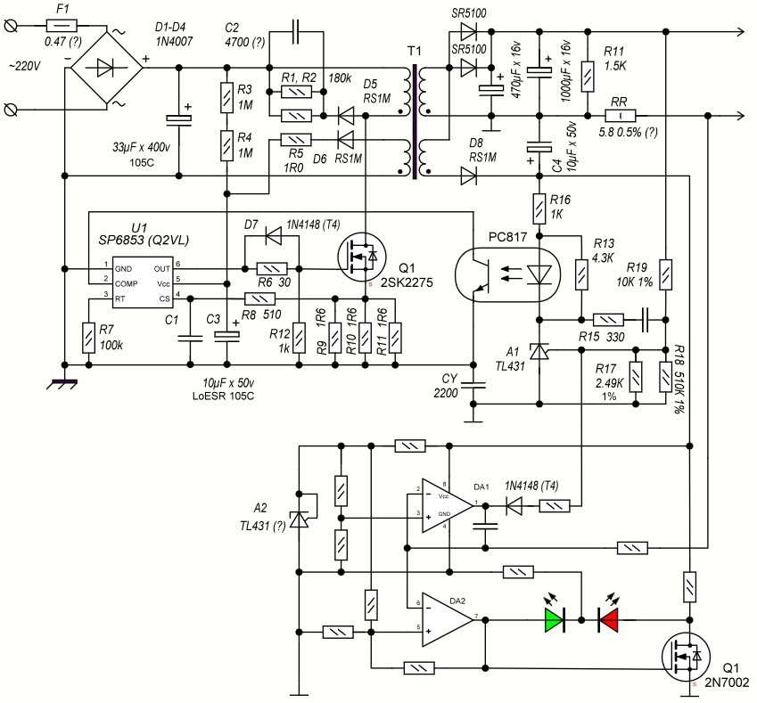
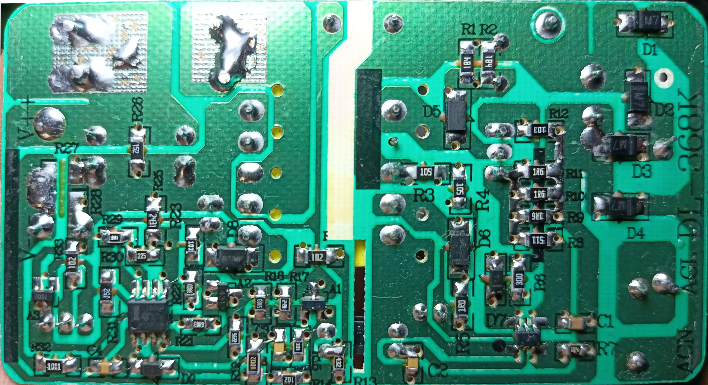
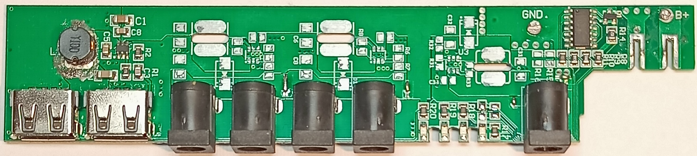

# Penxess-6 “Mini-UPS 12.6 V” – 3S charger board

Reverse-engineering notes for the **3S Li-ion charger board** used in a cheap  
“Mini-UPS 12.6 V” unit sold under the **Penxess-6** (and similar no-name) brand.

The whole “UPS” was advertised as:

- **60 000 mAh** capacity (of course it was),
- enough power “for routers / cameras / NAS / everything”.

Reality check:

- the **main output** is basically the **raw 3S battery** (no real DC–DC regulation),
- the NAS expects a **stable 12 V**, and apparently its HDDs are powered straight from that rail,
- once the pack sags below ~11.5 V, the HDDs start misbehaving  
  (head parking, spin issues, all the usual low-voltage drama).

So as a NAS UPS it’s… not great. But the **charger board** itself is still worth documenting.

---

## What’s actually inside

The “UPS” internals are roughly:

- 3-cell Li-ion battery pack (3S),
- a simple LED “fuel gauge” built around an LM-series indicator IC,
- a very basic **boost converter** for the USB output  
  (no QC / PD / anything smart — just dumb 5 V),
- a separate **3S charger board** for **12.6 V** charging – that’s the part documented here.

The charger PCB is clearly **grown from an older through-hole design**:

- the layout originally targeted THT components,
- later adapted to SMD parts,
- which gives it a very distinctive *“ugly but functional”* look.

---

## Schematic

The 3S (12.6 V) charger circuitry was reverse-drawn into sPlan.

Artifacts:

- `sch.spl8`  
  Full **sPlan 8** schematic of the **3S charger board**.  
  > This is the **authoritative** version – use it if you want to edit or extend the schematic.

- `sch_overview.jpg`  
  Full-size **JPEG export** of the schematic for quick viewing.  

  [](charger_3s_12.6V/sch_overview.jpg)

  > The image is provided **for preview only**; if there are any minor updates,  
  > they will first appear in `sch.spl8` and only later in the JPEG (if at all).

---

## Charger board – visuals

Photos of the charger PCB in all its recycled-layout glory:

| Top view (assembled board) | Closer / adjusted view |
| --- | --- |
| [](./pcb_face.jpg) | [](./pcb_v2_adj.jpg) |

You can clearly see:

- heritage of the **through-hole era** (odd pad shapes / spacing),
- SMD parts grafted onto a layout that was never meant for them,
- but overall a fairly standard **3S Li-ion charger** topology.

---

## Main “mini-UPS” board – context

For reference, here’s the **main UPS board** that this charger belongs to  
(with the simple USB DC–DC and LED indicator logic):

[](../pcb_ups_bad.jpg)

Highlights:

- “LED fuel gauge” on an LM-like driver IC,
- basic **step-up for USB output**, with no negotiation / protocols,
- battery output routed more or less directly to the “12 V” port.

This README focuses on the **charger module**, not this main board —  
the main UPS PCB is electrically quite simple and, frankly, not very interesting.

---

## Project layout

This README belongs to:

```text
ups_Penxess-6 Mini-UPS_12.6v/
  charger_3s_12.6V/
    sch.spl8                   – full schematic of the 3S (12.6 V) charger in sPlan 8 format
    sch_overview.jpg           – JPEG preview of the charger schematic
    pcb_v2_adj.jpg             – photo of the charger PCB (“ugly but functional” layout)
    README.md                  – this file

  pcb_ups_bad.jpg              – photo of the main “mini-UPS” board (one level up)
```

## Status

Current documentation status:

- 🟡 **Charger schematic** – captured and readable from the board photos, exported as `sch_overview.jpg`.
- 🔘 **Main “UPS” board** – only visually inspected; no full schematic drawn (simple, mostly uninteresting).
- 🔘 **Measurements / limits** – no systematic characterization yet  
  (max safe charge current, thermal behavior, long-term reliability).

This is mainly a **reference snapshot** for anyone who bought the same “miracle mini-UPS” and  
wants to understand or repair the charger section.

---

## Safety notes

Even though this thing is sold as a tiny plastic box with big numbers on the label, it is still:

- a **Li-ion battery charger** for a **3S pack** (up to 12.6 V),
- directly connected to **mains** through a cheap SMPS,
- capable of delivering a few amps into cells.

If you tinker with it:

- never leave experiments **unattended while charging**,
- monitor cell temperatures and voltages,
- don’t push it beyond what the PCB traces, components, and your cells can reasonably handle.

Use this documentation at your own risk; no guarantees of correctness or completeness.

---

## Trademarks & naming

- “Penxess-6 Mini-UPS 12.6 V” is used here only as a description of the product as sold online.
- All brand names and logos belong to their respective owners.
- This repository is not affiliated with any of the manufacturers / resellers involved.
