# Penxess DC‑UPS: reverse engineering, teardown, and “file‑and‑fit” to a proper 12V (and not only)

> This README is a new, expanded version of the project description. The old file in the repo was more like “notes about the 3S charger”, without the full story and without the whole upgrade path.
> Here I’m just describing, in a human way (and a bit in my own style), how a “purely Chinese little box” turned into a more‑or‑less decent DC‑UPS module for my needs.

---

## Why DC‑UPS matters at all (and where everyone usually crashes)

In Ukraine, DC‑UPS boxes have become super popular in the last few years: “for a router”, “for CCTV”, “for anything”. Sellers almost always write **12V** in the listing, but in practice, for most of these devices “12V” is not “stable 12” — it’s **just the battery voltage**.

And the battery inside is usually **3S Li‑ion**:
- fully charged it’s **12.6V**,
- during discharge it calmly drops to **9…10V**.

For a router it’s often acceptable: it can survive 9–12V, or it has its own internal regulator. But for a **mini‑PC / NAS** — not always.

In my case the NAS is powered from **12V**, and in some configurations those 12V go with almost no stabilization straight into the **3.5" HDD** power rail. And HDDs on the 12V rail usually want something like **11.5…12.5V**. So when the battery sags, the circus starts: the heads click (auto‑park), the NAS throws errors, and the mood goes downhill.

So if you actually need “12V as 12V”, the correct answer is **buck/boost** (a.k.a. step‑up/step‑down): a module that can **both lower and raise** voltage. Because a plain step‑down won’t save you (when the battery is below 12), and a plain step‑up is also not the answer (when the battery is above 12).

---

## The patient: Penxess (the famous “60000 mAh, 12V 8A”, yeah right…)

So, the hero of this story is a DC‑UPS called **Penxess**.

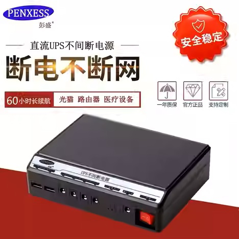

At some point I was looking for a UPS for my NAS. Consumption is around **45W** (the stock PSU is 65W, but my drives are 5400rpm — not the most hungry set). At that time the market was full of “router DC‑UPS” boxes rated 18–36W. And then I see this box: advertised as 60000 mAh, and output “12V 8A”. So of course I buy it.

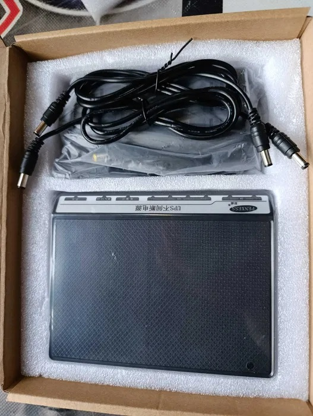  |  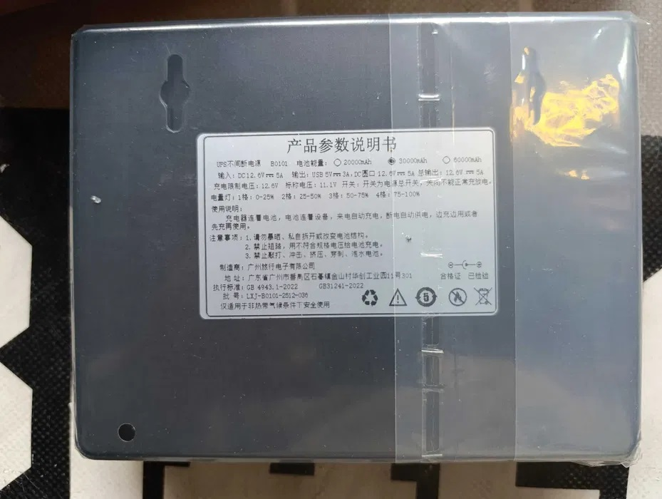

From the first glance it’s a very “China‑China” device: everything in Chinese, stickers, labels… not exactly confidence‑inspiring. So naturally the first thing is: open it and see what’s inside. And after opening it I came to a few conclusions.

---

## What’s inside: the charger is separate, the “UPS logic” is almost zero

### 3S charger (12.6V): it works, but the budget shows immediately

Let’s start with the charging module. It’s a typical **Li‑ion 3S CC/CV** charger. It claims something like **3A** charge current. Technically it indeed “can charge”, but the design is as cheap as it gets: no input filtering, no fuse, no NTC — basically the minimum set of parts. Visually the PCB looks like an older **through‑hole** design that was later awkwardly adapted to SMD (the “ugly but functional” vibe).

Charger PCB photos:

| | |
|---|---|
| 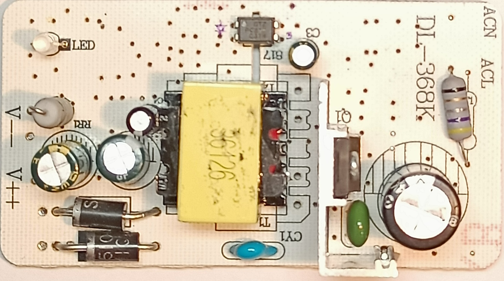 | 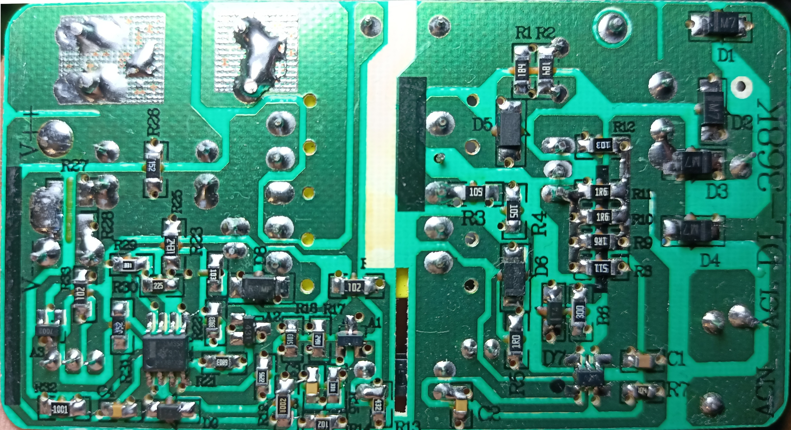 |

I redrew the schematic (nothing exotic there, but it’s useful to capture it):

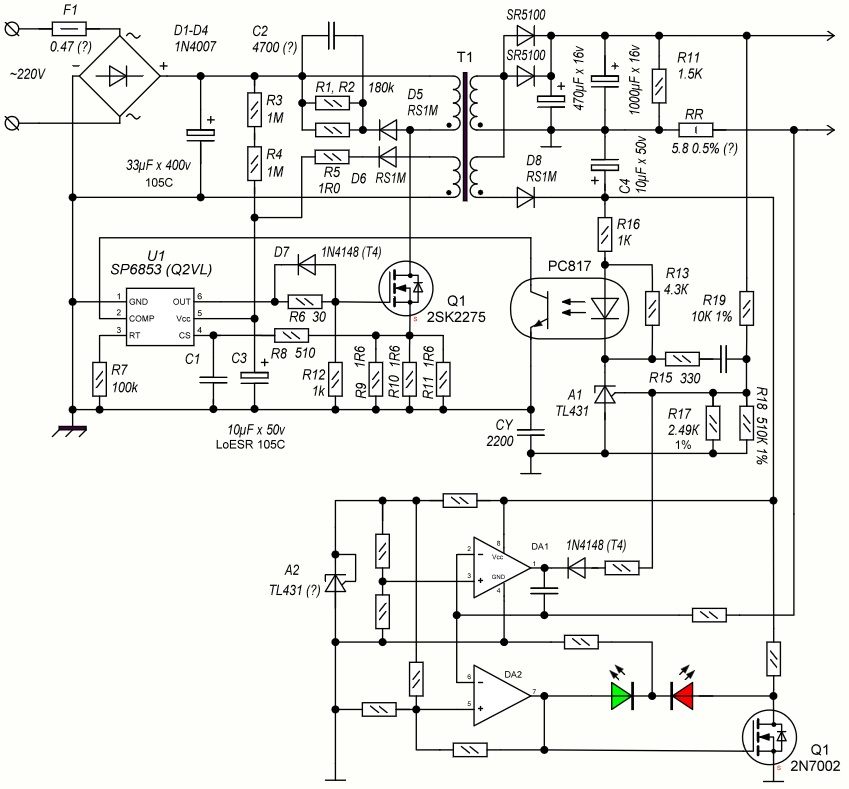

> By the way, historically this is the part I documented first — the old README in the repo was basically about this.

### The main “UPS” board in Penxess: almost empty

And now the fun (and sad) part. Apart from the cells (the battery), inside there is **almost nothing**. The main board looks like “wiring + a couple of small add‑ons”: there’s a simple DC‑DC for USB 5V and a very primitive battery level indicator based on **LM324** (three thresholds / three “steps”).

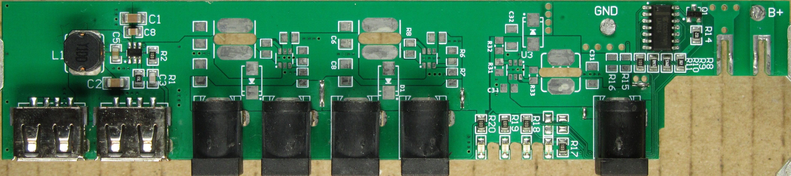  
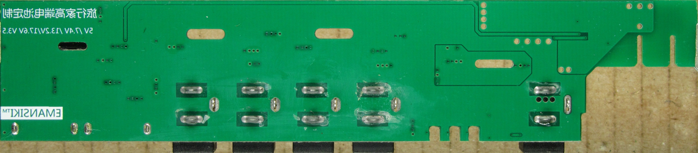

There’s also a funny detail with the indicator: one LED “25%” is basically always on until the BMS cuts the battery off on deep discharge. The other LEDs turn on at some battery voltage thresholds, but I never bothered to measure the exact levels — and later they stopped lighting up at all (either the divider resistors aged badly, or the LM324 itself died).

And that’s it: input, output and the battery are effectively all paralleled together. Which means we get these features:

- no stabilization at all — output is **9…12.6V** depending on battery state;
- the charger feeds both the battery and the load at the same time (not great, because there are no separate charge/discharge paths — everything is in parallel);
- and the most annoying part: in this topology the battery is effectively kept on float, i.e. held at **12.6V** whenever the charger is present. It’s not instantly dangerous, but it **shortens Li‑ion lifetime**: cells degrade faster if you keep them at 100% charge all the time.

---

## The main “surprise” of the topology: everything is paralleled → there is zero stabilization

Once you realize it’s “battery = output”, the whole marketing collapses into simple physics. The box is not a UPS in the “power supply engineering” sense — it’s just a battery pack with a charger and a couple of indicators. And that’s why for anything that actually needs a stable 12V rail (especially with 3.5" HDDs) it’s a bad match out of the box.

---

## Why the NAS suffers from this (and how I verified it)

After opening Penxess, it became immediately clear: for a NAS this box is not suitable, because my NAS uses **3.5" drives** and they want a sane 12V rail. The NAS itself doesn’t do extra stabilization for that input.

I tested it experimentally: at about **11.6V** on the rail the drives start clicking (auto‑park triggers), and the NAS begins to throw errors because of that.

I considered putting a buck/boost converter inside the case, but there isn’t that much space, and I didn’t want to build a little oven inside. So at first I decided to drop the NAS idea and power a router from this thing instead.

Later, though, I returned to the idea anyway: make it more universal by installing a buck/boost inside and splitting the existing four outputs into two groups — two “raw” (9–12V battery) and two stabilized via buck/boost. That would allow “whatever voltage you need” on those outputs (roughly 7–32V, depending on the module).

---

## First proper upgrade: separate charge/discharge paths (without shamanism around LM324)

I didn’t like the “everything in parallel” topology at all. So the first upgrade idea was to stop keeping the battery permanently on the charger — in other words, make separate charge and discharge paths.

My first thought was to reuse the LM324 as a threshold detector and add a couple of MOSFETs to steer charge/discharge. But that would require designing a circuit and figuring out how to integrate it into that cramped board.

So I “scraped the bins” and found a ready‑made DC‑UPS board I had, built around some mysterious chip marked **CR123S**. It already does what I need, and it’s advertised as a “50W board” (the board says so). Realistically, I’d treat it as ~25–30W unless cooling is decent. Still, for my purposes it was a good base. So instead of hacking my own circuit, I decided to use this board:

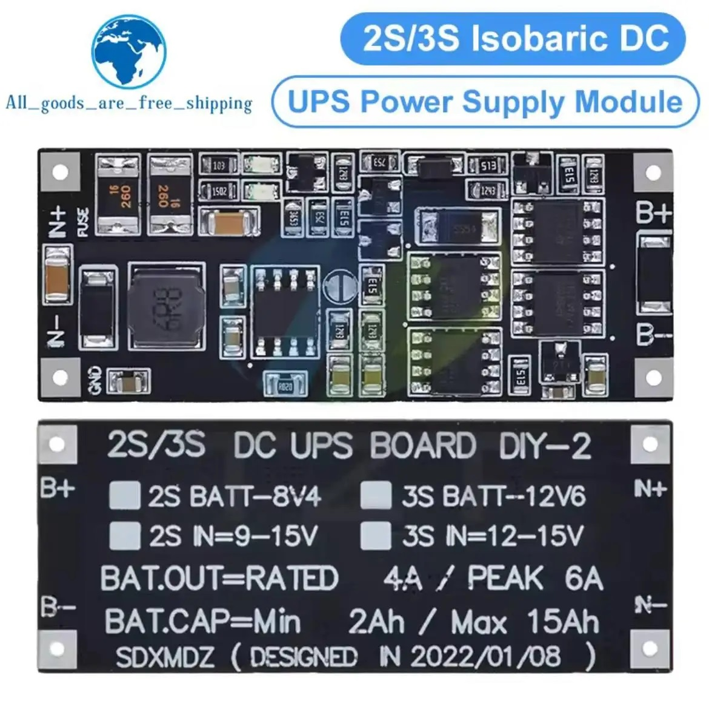 | 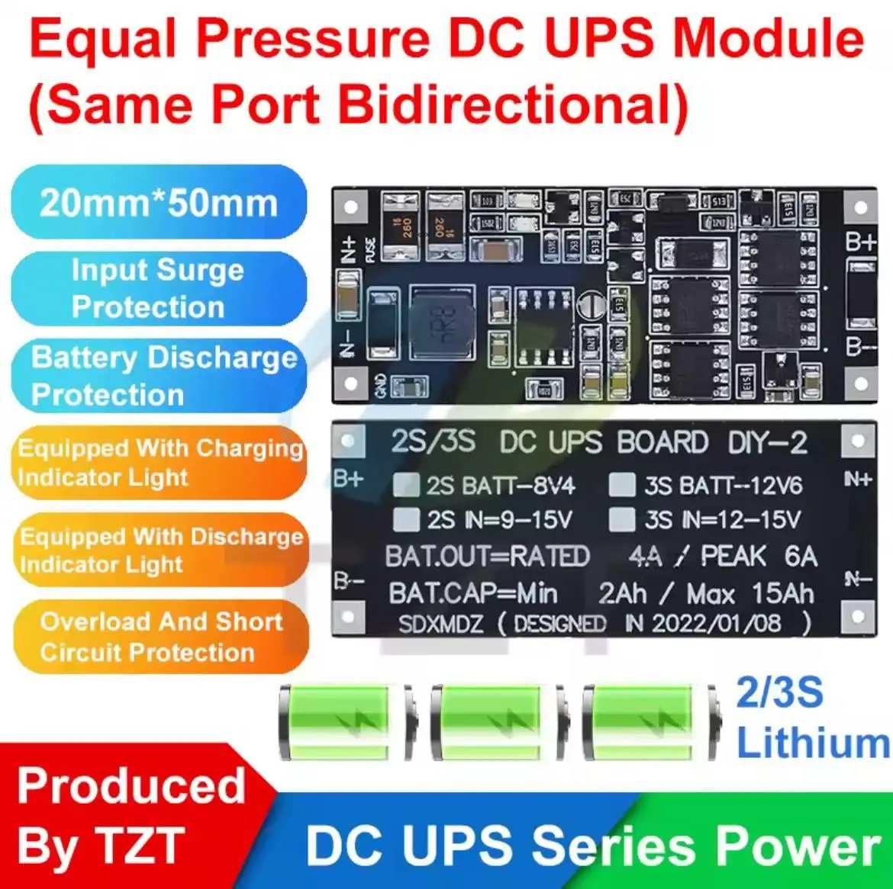 | 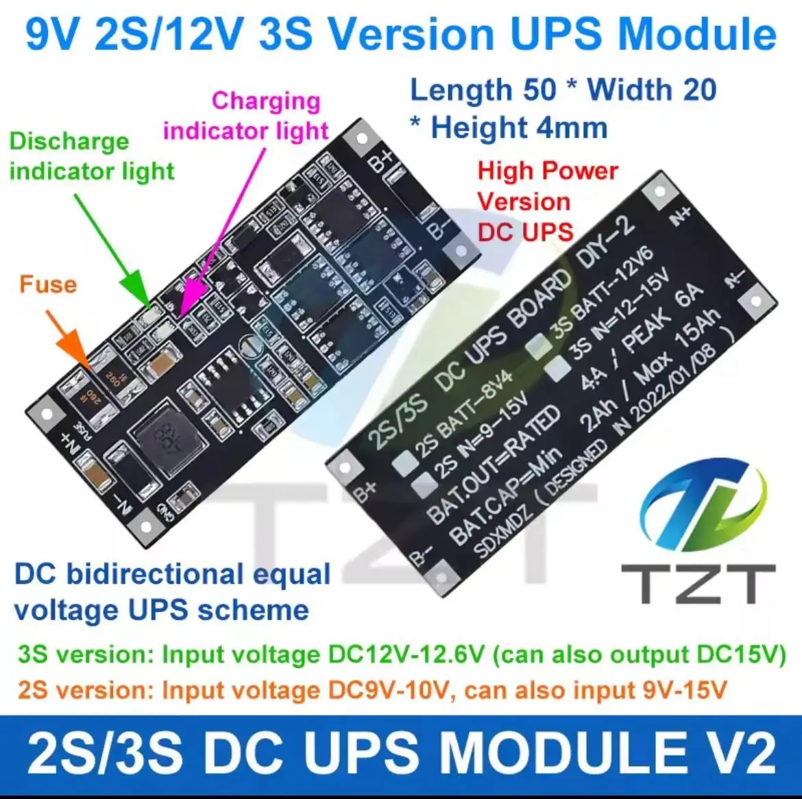

Adapting the Penxess main board was minimal: I only used a rotary tool to cut one trace between the switch and the board input to route things correctly:

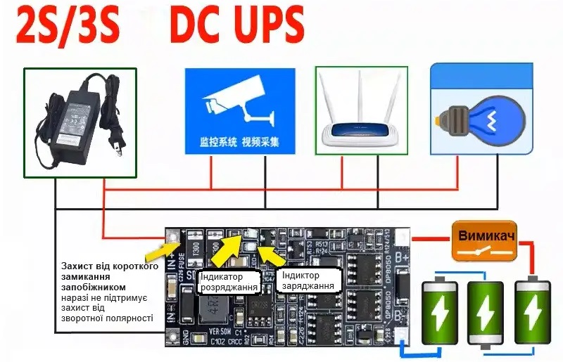

---

## How the CR123S board behaves in practice (tests, not “faith in marketing”)

I also found a review that describes some not‑so‑obvious quirks of this DC‑UPS board (I’m keeping it here because it matches what I saw):

A good power supply module for a router, but there are some issues with the indication and power supply. I ordered this 2S/3S DC UPS BOARD DIY-2 module to power the router. I use it with a 3S assembly (12.6V screwdriver battery). Pros: The board hardly heats up, which is very pleasing. There is no internal DC-DC converter at the output (the voltage flows directly), so there are no unnecessary energy losses and high efficiency. The possibility of connecting high-capacity batteries. Disadvantages and features: The green LED (indicating full charge/network connection) does not light up at all. Only the red light is on while charging. Very demanding on the power supply unit: for a 3S assembly of a standard battery at 12V it's not enough, you need a high-quality unit at 12.8V - 13V. The charge stops at the 12.76V mark. There is a suspicion that the BMS of the battery itself is cutting off the power, rather than the controller board. Please note that the board has a built-in 75-minute charging timer — if the battery has a large capacity, it may not have time to fully charge in one cycle. A practical solution for your money, if you understand how it works.

Then I tested it myself, and here are the results:

1) This board has **no cold start**. When you connect the battery with a switch, voltage does not appear on IN+/IN- by itself. You need at least a brief presence of input voltage from the PSU on those terminals.

2) The board itself manages battery charging (CC/CV), so you don’t need the original external charger. You can use a normal PSU, but the PSU voltage should be around **12.8…13V**. **12.6V is not enough**: the battery will be undercharged. Most likely this is due to internal voltage drops (diodes and/or MOSFETs).

3) There is a charge indicator (red LED). Testing showed the board does **not** keep the battery at full charge all the time: charging stops at **12.6V**, and the charger kicks in again when battery voltage drops below **12.4V**.

4) There is also a “discharge” LED (green), but it behaves weirdly — exactly like the review says. It lit up at the beginning, then went off and never lit again. Either there are extra conditions nobody knows, or it just dies, or the LED current is chosen wrong. (On another identical board that LED still works for now.)

5) The MOSFETs needed a heatsink. I made one from a spare SSD heatsink kit. The board is advertised as 4A, but I limited testing to **3A** (~30W), which is plenty for a router. At that current the heatsink warms up to about “~50°C by finger”.

6) I tried a longer load at **2.5A** to see whether the board has a low‑voltage cutoff or relies on the battery BMS. It does have a cutoff: the load is disconnected at **10.4V** on the battery.

---

## Back to the buck/boost idea and 45–50W: stacking two DC‑UPS boards in parallel

Since I still wanted to install a buck/boost module into this case and use the hardware as fully as possible, I aimed for a real output capability of **45–50W**.

The buck/boost module itself (based on what is printed on its PCB) is “>100W”, but that’s usually “with active cooling”, and the BMS looked like it was intended for maybe 6–8A. The DC‑UPS boards advertise “stacking” (parallel operation), so I decided to use that and connect **two boards in parallel**.

Reasons:
- to have enough output capability (not just “marketing watts”);
- and because one board charges at only **~1.1…1.2A**, which is small for a large battery pack.

And the case actually had enough space. So I assembled a custom module of two DC‑UPS boards, shaped to fit the case:

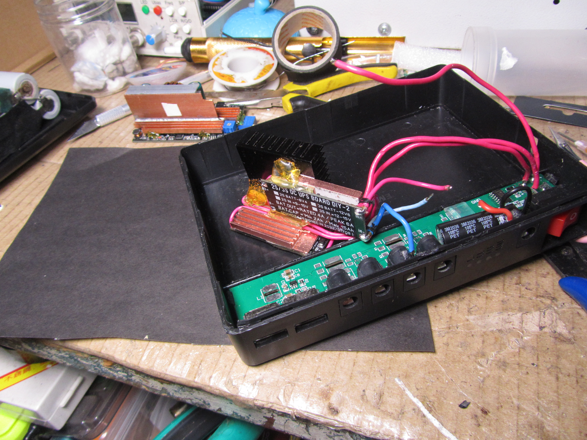

And the internal layout looks like this:

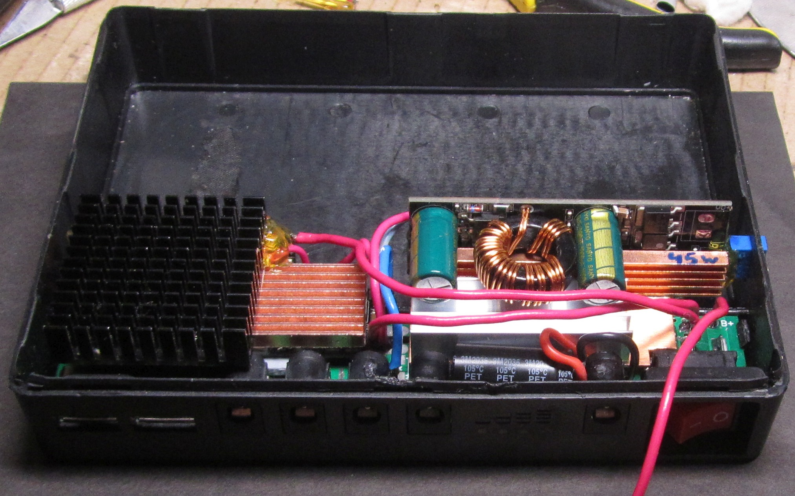
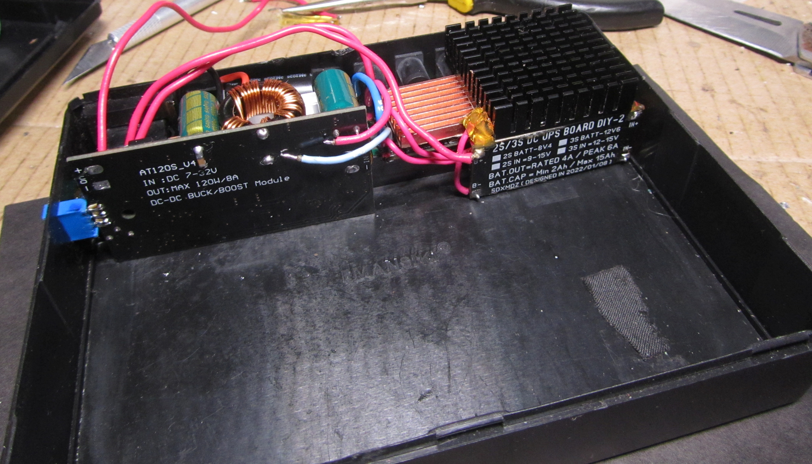

---

## Choosing the buck/boost module and reworking cooling for the case

For the buck/boost role I had two candidates: one based on **LT3850**, and the other — something like “PL5501” class (the exact marking/model isn’t as important here as size and thermal behavior).

  

The LT3850 option simply **didn’t fit** by dimensions, while the second one fit nicely.

A couple of words about this “second” module, because I had it **on hand**, and in this rebuild it became the actual workhorse. It’s the popular class of boards often sold as **AT120 / 8A / 120W (sometimes they claim 150W)**. I’m not doing a “battle of 115 converters”, but by feel and by my measurements this module is genuinely decent: in sane modes it works efficiently and doesn’t instantly turn into a hot iron once you ask for real power.

There’s also the classic marketing story around it. Some sellers like to claim it uses **LTC3780**. In reality, different revisions of these boards come with different controllers. In my sample the controller is marked **“5501”**. Honestly, what matters to me is not the “sacred chip name”, but that the module holds load normally and behaves predictably thermally. For real 45–50W I still assumed a safety margin anyway: in wiring (especially the “minus” path), and in cooling, because in a tiny enclosure any “100W on the sticker” very quickly becomes “ten minutes and it smells”.

I ran it for heating and quickly realized the stock heatsink needs help. So I increased the heatsink area, adapting it to the available space in the case, and the board ended up looking like this:

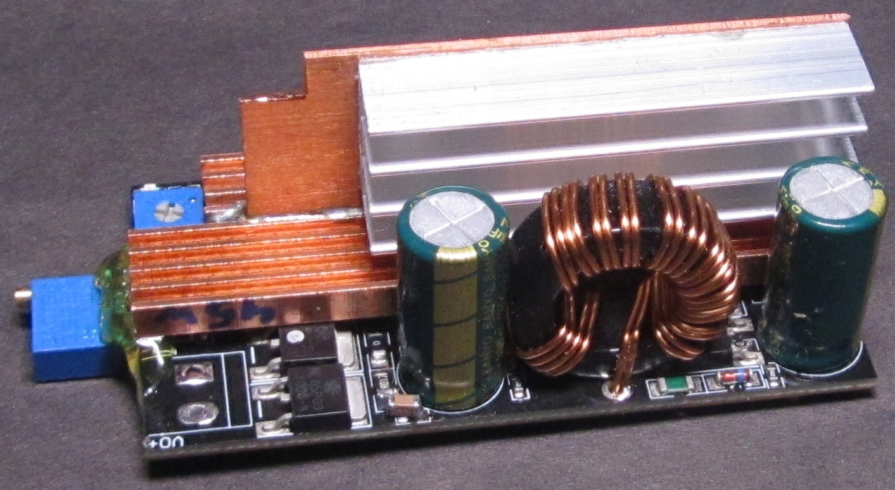  
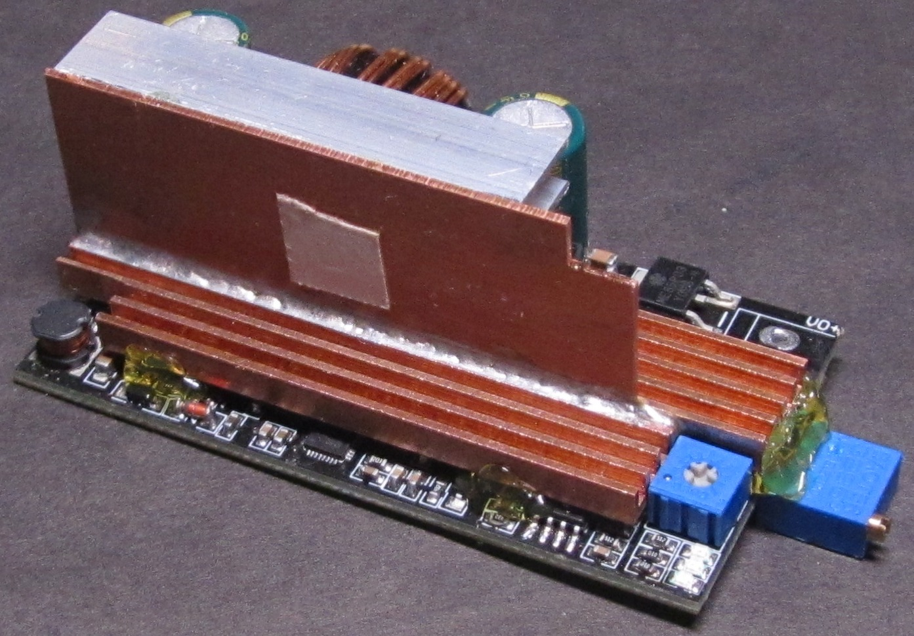

And the final “everything in its place” internal layout looks like this:

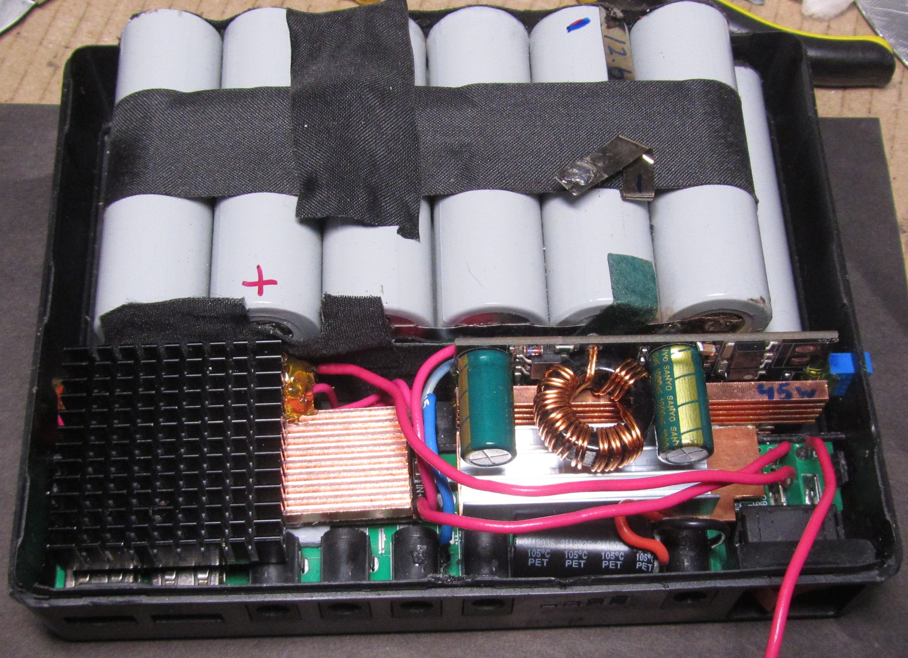

---

## Settings: voltage adjustment outside, power limit inside

This buck_boostb board has two adjustment trimmers. One is output voltage. I turned it around and **brought the adjustment outside the case**, so I can tweak voltage without opening the device.

The second trimmer is output power limiting: if you exceed it, the board shuts down. I had no clean way to bring it outside (without ugly hacks), so I set it internally to about **47W** using an electronic load — so that it can reliably deliver **45W** at the output in a stable mode.

Additionally, I added a **1000µF electrolytic** at the input, and it fit very neatly into a free spot above the charge indicator LEDs.

---

## Classic genre: while testing everything — the battery BMS died

And to make life more “fun”, during assembly and testing my battery **BMS board died**. So in parallel with the mechanical/electronic work I got another very practical task: find a decent replacement (current capability, protections, and overall sanity of design).

---

## About indicators (and why I didn’t bring them to the front panel yet)

All used boards have pretty handy status/error LEDs. Ideally it would be nice to bring them to the front panel so you can see statuses without opening the case.

But for now I postponed it: it’s SMD, you’d have to add wires, and that’s another layer of “careful hackery” I just didn’t want to spend time on at this stage.

---

## Where we are now (short, but to the point)

In the end, Penxess went from a “parallel nonsense” into a more meaningful module:
- charge/discharge logic is now handled by the CR123S DC‑UPS boards (two in parallel),
- buck/boost is installed in the case and has proper cooling,
- voltage adjustment is outside,
- power limit is set around ~47W (for stable 45W).

And the most important part: it’s no longer “output = battery”, so there is a real chance to get not only a router UPS, but a more universal DC power module for different scenarios.

---

## A note to myself (and for anyone repeating this)

If you bought a “12V DC‑UPS” and think it’s “like a 12.0V PSU” — no, in most cases it’s “like how the battery feels today”. Penxess is a classic example: the marketing is pretty, but inside the topology is максимально primitive. And if the task is NAS / HDD / anything sensitive to 12V, then without buck/boost (or without proper UPS logic) you’ll very quickly get “click‑click” and errors.

---
