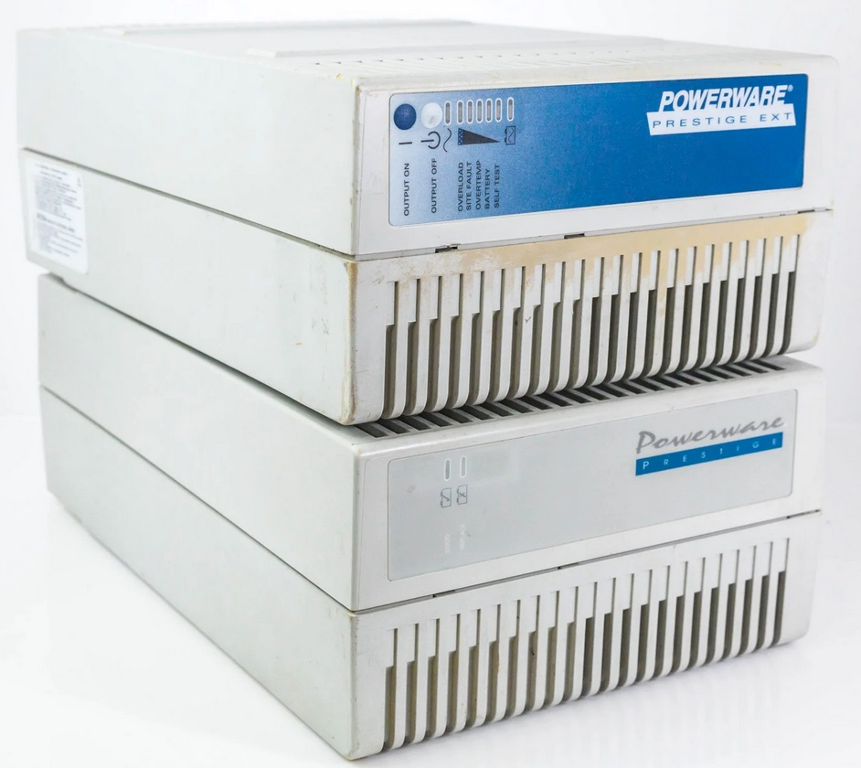
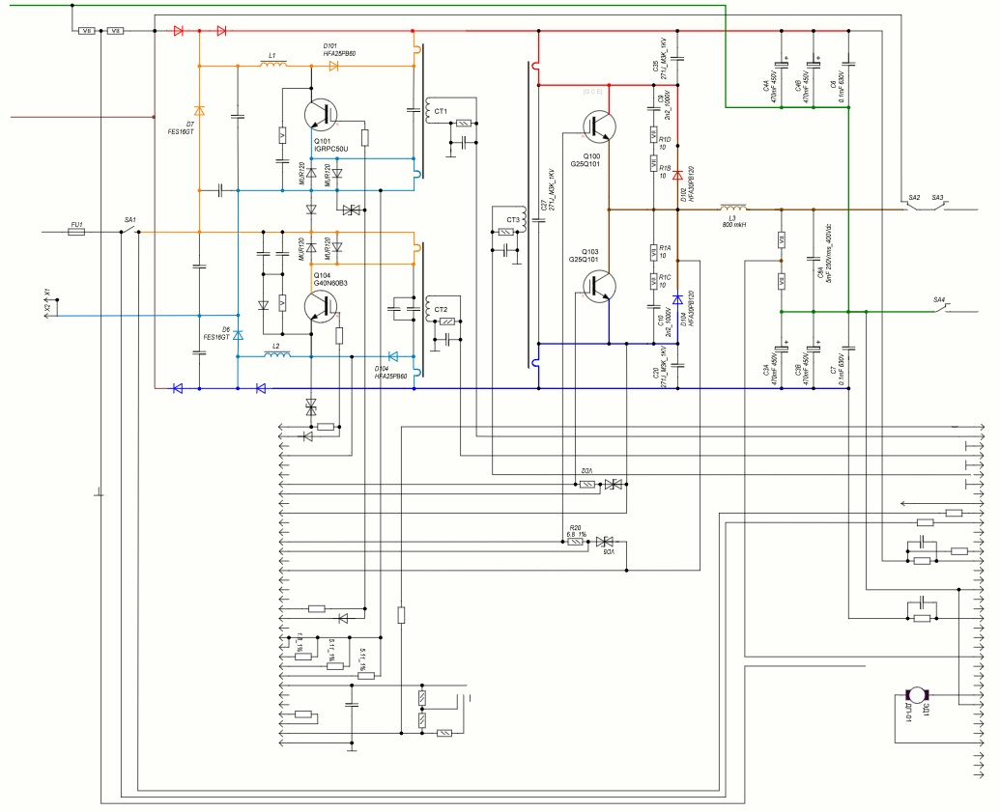

# Powerware 9 Prestige Series 600–1800 VA UPS – Reverse Engineering

Reverse-engineering project for the **Powerware / Eaton Powerware 9 Prestige Series 600–1800 VA** online UPS.

The goal of this repository is to document:

- Power & control board **schematics** (reverse-drawn)
- **PCB layouts** traced from photos
- **Firmware dump** from the 27C256 ROM
- Notes on disassembly and analysis of the **MC68HC11** controller code

…so that other people repairing or studying these UPS units can actually find some technical information by searching the web.

---

## Device identification

Single-phase **online (double-conversion) UPS**, branded as:

> **Powerware 9 Prestige Serie, 600–1800 VA**

Front-panel / case photo for visual identification:

[](./_img/device.jpg)

Click the image to open the full-size version.

---

## Hardware overview

The UPS is split into two main boards:

1. **Power board** (`./power_board`)
2. **Control board** (`./control_board`)

### Power board

- No mains-frequency transformer – the design uses **boost converters on inductors** (classic step-up topology).
- Battery pack: **60 V** DC.
- Two boost stages (positive and negative rails) generate approximately **+310 V / –310 V** DC.
- A subsequent H-bridge / inverter stage synthesizes the output **sine wave** from the ±310 V rails.

Artifacts in the repo:

- `./power_board/sch.spl8`  
  Reverse-drawn **schematic** of the power board in **sPlan 8** format.  
  > Status: ~**90% complete** – good enough to understand the topology, some minor details may still be missing.

- Schematic preview for non-sPlan users (`./power_board/sch_overview.jpg`):  

  [](./power_board/sch_overview.jpg)

  > This JPEG export is provided **for quick viewing only** and may lag behind the  
  > `sch.spl8` source project in terms of completeness or minor corrections.  
  > The sPlan file should be considered the primary, most up-to-date reference.

- `./power_board/pcb/pcb.lay6_2.lay6`  
  Power PCB in **Sprint-Layout 6** format, traced from photo templates.  
  **Important note:** this is **not** a manufacturing-ready PCB:
  - element sizes and track widths may not match the original,
  - main purpose is to **match front/back layers and connections** for schematic reverse-engineering.


### Control board

The control board hosts the **MCU** and low-voltage logic that drives the power stage.

- MCU: **Motorola/Freescale MC68HC11 family** (ROMless variant with external EPROM)
- External ROM: **AT27C256** (32 KiB)

Artifacts:

- `./control_board/pcb_prestigio_ctrl.lay6`  
  Sprint-Layout 6 project for the **control board PCB**, traced from photos.  
  > Status: **work in progress**, early routing used as a helper to understand connectivity.

- High-quality panoramas of the control board (both sides):  

  **Component side (face):**  
  [](./control_board/pano/panorama_face.jpg)

  **Solder side (back):**  
  [](./control_board/pano/panorama_back.jpg)

  These panoramas are intended for **component identification** (all SMD markings are readable)
  and for cross-checking the Sprint-Layout project.

---

## Firmware

The control board uses an external **27C256** EPROM with the UPS firmware.

- `./rom/27c256.bin`  
  Raw **firmware dump** from the AT27C256 EPROM  
  (read with a **GQ-3X** programmer).

### Ghidra disassembly project

- `./rom_dasm/`  
  Ghidra project for disassembling and analysing the 27C256 firmware.

Ghidra does **not** support the MC68HC11 instruction set out of the box, so you need an additional language module:

- **MC68HC11 language for Ghidra** (third-party project):  
  <https://github.com/GaryOderNichts/ghidra-hc11-lang>

#### How to use with Ghidra (short version)

1. Install Ghidra.
2. Clone / download [`ghidra-hc11-lang`](https://github.com/GaryOderNichts/ghidra-hc11-lang) and install it into Ghidra’s `Processors` folder (see that project’s README).
3. Open the project in `./rom_dasm/` (e.g. `HC11_UPS.gpr`).
4. Make sure the program is loaded as:
   - **Processor**: HC11
   - **Base address**: `0x8000` (27C256 mapped to `0x8000–0xFFFF`)
5. The reset vector at `0xFFFE` should point into the ROM and decompile into the main initialization routine; from there you can follow the usual reverse-engineering workflow (ISRs, main loop, event flags, etc.).

> The disassembly / analysis is **in progress**, not complete. Function names, flags and comments will likely evolve over time.

---

## Repository layout

```text
_img/
  device.jpg                 – photo of the UPS (front/case)

power_board/
  sch.spl8                   – reverse-drawn power board schematic (sPlan 8)
  pcb/
    pcb.lay6_2.lay6          – Sprint-Layout 6 project for the power PCB (for reverse only)

control_board/
  pcb_prestigio_ctrl.lay6    – Sprint-Layout 6 project for the control PCB (WIP)
  pano/
    panorama_face.jpg        – control board, component side
    panorama_back.jpg        – control board, solder side

rom/
  27c256.bin                 – raw EPROM (AT27C256) dump, MC68HC11 code

rom_dasm/
  ...                        – Ghidra project for disassembling 27c256.bin
                              (requires ghidra-hc11-lang)

README.md                    – this file
```

## Status

- ✅ Power board schematic – **~90% complete**  
- 🟡 Power board PCB tracing – **usable for connectivity / net tracing**, not for fabrication  
- 🟡 Control board PCB – **early tracing / WIP**  
- 🟡 Firmware disassembly – **ongoing** (ISRs, main loop, SCI, event/logging system already partially documented)

Contributions (photos, measurements, dumps from other ratings in the **600–1800 VA** range, etc.) are very welcome.

---

## Safety notice

This project deals with:

- **Mains voltage** (230 V AC or similar),
- **High-voltage DC rails** (~±310 V),
- **60 V battery packs** with significant stored energy.

Working on live UPS hardware is **dangerous** and can be **lethal**.

- Do **not** attempt repairs or modifications unless you understand high-voltage safety.
- Always use isolation transformers, proper test equipment, and follow safe work practices.
- The information here is provided **for educational and repair/diagnostic purposes only**, with no guarantees.

---

## Trademarks & copyright

- **Powerware**, **Eaton** and any model names (e.g. *Prestige Series 600–1800 VA*) are trademarks of their respective owners.
- This repository contains **reverse-engineered documentation** and a ROM dump for **research, education and repair**.  
  Original firmware and designs remain the intellectual property of their respective owners.
- If you are the rights holder and have concerns about any particular file or detail, please contact the maintainer of this repository.
