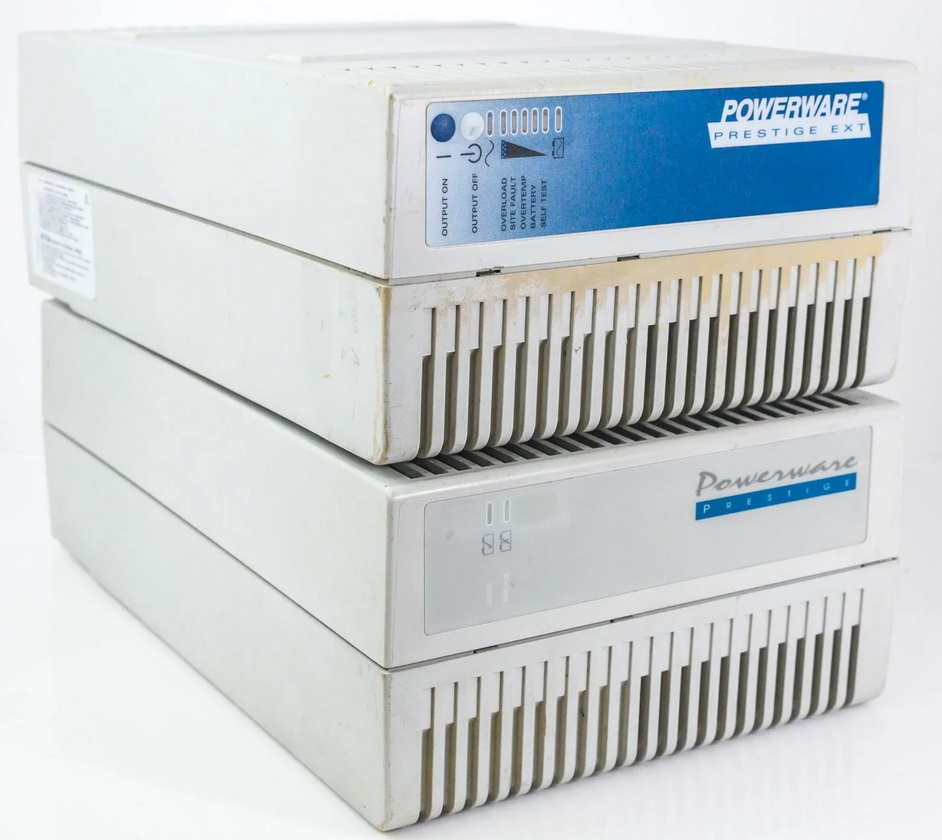
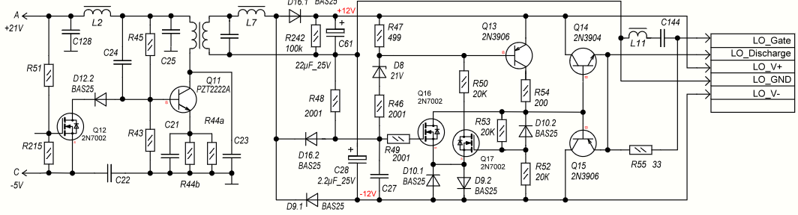
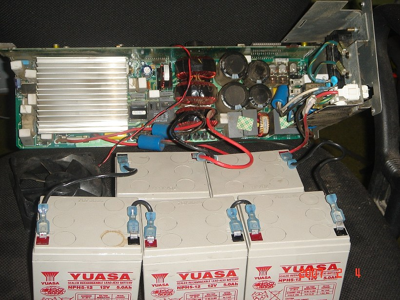
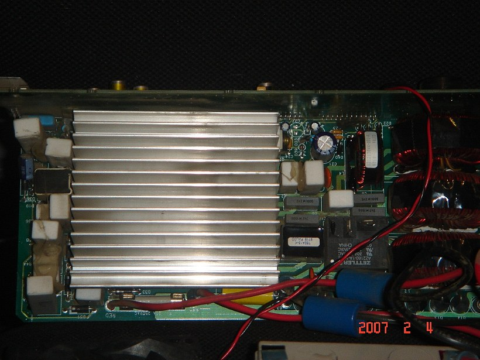
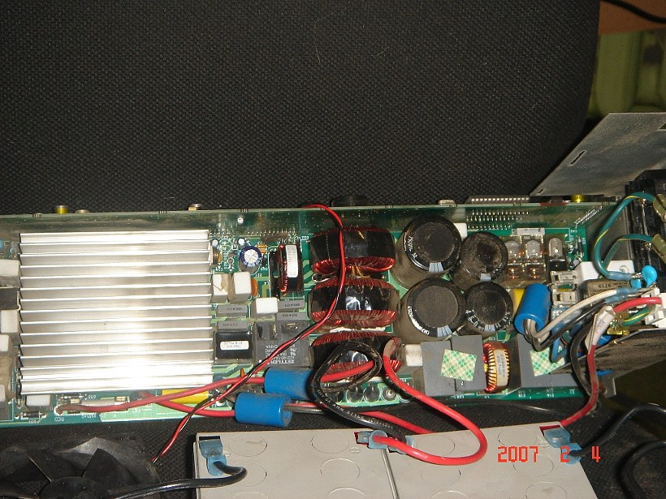
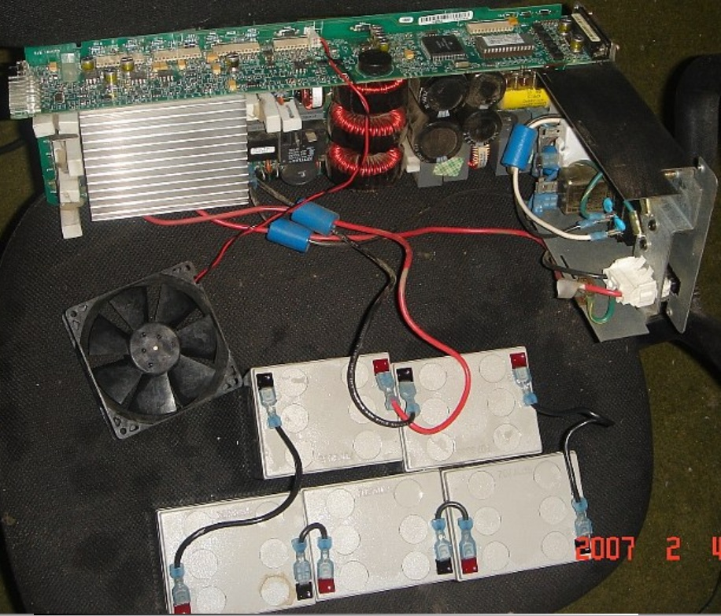

# Powerware 9 Prestige Series 600–1800 VA UPS – Reverse Engineering

Reverse-engineering project for the **Powerware / Eaton Powerware 9 Prestige Series 600–1800 VA** online UPS.

The goal of this repository is to document:

- Power & control board **schematics** (reverse-drawn)
- **PCB layouts** traced from photos
- **Firmware dump** from the 27C256 ROM
- Notes on disassembly and analysis of the **MC68HC11** controller code

…so that other people repairing or studying these UPS units can actually find some technical information by searching the web.

---

## Device identification

Single-phase **online (double-conversion) UPS**, branded as:

> **Powerware 9 Prestige Serie, 600–1800 VA**

Front-panel / case photo for visual identification:

[](./_img/device.jpg)

Click the image to open the full-size version.

---

## Hardware overview

The UPS is split into two main boards:

1. **Power board** (`./power_board`)
2. **Control board** (`./control_board`)

### Power board

- No mains-frequency transformer is used in the DC/HV-DC conversion path. Instead, the UPS uses **high-power classic boost-converter stages built around inductors**.
- Battery pack: **60 V** DC.
- Two boost stages generate approximately **+310 V / –310 V** DC rails.
- A subsequent H-bridge / inverter stage synthesizes the output **sine wave** from the ±310 V rails.

This is a distinctly older design, typical of equipment from the 1990s: even the isolated IGBT gate drivers are built from discrete transistors, diodes, zener diodes, resistors and capacitors rather than dedicated gate-driver ICs. Technologically it is dated, but from an engineering and reverse-engineering point of view it is quite interesting.

Artifacts in the repo:

- `./power_board/sch.spl8`  
  Reverse-drawn **schematic** of the power board in **sPlan 8** format.  
  > Status: ~**90% complete** – good enough to understand the topology, although some minor details may still be missing.

- [`./power_board/sch.svg`](./power_board/sch.svg)  
  SVG export of the same schematic for convenient viewing directly on GitHub. Unlike the old overview image, this is the **full power-board schematic**, including the power stages, gate drivers and associated circuitry.

  [](./power_board/sch.svg)

  > The **sPlan file remains the primary editable source**. The SVG is intended as a convenient viewable/exported version and is kept synchronized with it.

### IGBT gate driver

One isolated gate-driver channel is also available as a separate schematic image:

[](./control_board/gate_drv_sch.png)

The driver is implemented entirely from discrete components and uses a **high-frequency isolation transformer**. The primary-side transistors **Q11/Q12** excite the transformer; Q12 is driven by the controller signal, which appears to be carried as a burst/high-frequency-modulated waveform rather than as a static logic level.

On the isolated secondary side, the same transformer provides both **power and control information** for the driver:

- **D16.1 / C61** generate the approximately **+12 V** rail;
- **D9.1 / C28** generate the approximately **−12 V** rail;
- **Q14/Q15** form the output stage connected to the power IGBT gate, with Q15 providing the active gate-discharge path.

While high-frequency energy is present on the transformer secondary, C61 and C28 charge through their rectifier paths. Once the total isolated supply span becomes high enough, the **D8 (21 V) / Q13** threshold network changes state. Q13 then drives Q14, causing the IGBT gate to be charged. At the same time, Q17 is driven on through R53 and provides regenerative feedback that keeps the driver in its **ON state**. In other words, this part of the circuit behaves as a small discrete latch rather than requiring the transformer waveform itself to source the IGBT gate continuously.

Turn-off is handled by **Q16**. While the required high-frequency component is still present on the transformer secondary, negative excursions through **D16.2** prevent **C27** from charging to the Q16 turn-on threshold. When those pulses disappear, C27 charges through **R48**, Q16 turns on, Q17 is forced off and Q15 is driven on. The circuit therefore changes to its other stable state and actively discharges the power IGBT gate. The energy stored in C61/C28 allows this turn-off action to remain available briefly even after excitation of the isolation transformer has stopped.

This arrangement is an interesting example of an isolated, transformer-powered **set/reset gate driver built entirely from discrete components**.

- `./power_board/pcb/pcb.lay6_2.lay6`  
  Power PCB in **Sprint-Layout 6** format, traced from photo templates.  
  **Important note:** this is **not** a manufacturing-ready PCB:
  - element sizes and track widths may not match the original,
  - main purpose is to **match front/back layers and connections** for schematic reverse-engineering.

### Repair that led to this reverse engineering

This project started as a repair rather than as a purely academic reverse-engineering exercise. I bought this UPS, powered it up, and after roughly ten minutes it stopped starting normally and began entering a fault state. That made it necessary to trace the power circuitry and understand the gate-driver logic.

The UPS was ultimately returned to working condition. The fault was localized to the isolated gate driver for the **−370 V-side power IGBT channel**: **Q16 had failed**. Because Q16 is responsible for detecting the disappearance of the transformer excitation and switching the discrete latch into the gate-discharge state, its failure prevented the channel from operating correctly. Replacing the faulty device restored normal operation.

The repair was the main reason the power-board schematic, PCB tracing and the separate gate-driver schematic were produced.

### Control board

The control board hosts the **MCU** and low-voltage logic that drives the power stage.

- MCU: **Motorola/Freescale MC68HC11 family** (ROMless variant with external EPROM)
- External ROM: **AT27C256** (32 KiB)

Artifacts:

- `./control_board/pcb_prestigio_ctrl.lay6`  
  Sprint-Layout 6 project for the **control board PCB**, traced from photos.  
  > Status: **work in progress**, early routing used as a helper to understand connectivity.

- High-quality panoramas of the control board (both sides):  

  **Component side (face):**  
  [](./control_board/pano/panorama_face.jpg)

  **Solder side (back):**  
  [](./control_board/pano/panorama_back.jpg)

  These panoramas are intended for **component identification** (all SMD markings are readable)
  and for cross-checking the Sprint-Layout project.

---

## Firmware

The control board uses an external **27C256** EPROM with the UPS firmware.

- `./rom/27c256.bin`  
  Raw **firmware dump** from the AT27C256 EPROM  
  (read with a **GQ-3X** programmer).

### Ghidra disassembly project

- `./rom_dasm/`  
  Ghidra project for disassembling and analysing the 27C256 firmware.

Ghidra does **not** support the MC68HC11 instruction set out of the box, so you need an additional language module:

- **MC68HC11 language for Ghidra** (third-party project):  
  <https://github.com/GaryOderNichts/ghidra-hc11-lang>

#### How to use with Ghidra (short version)

1. Install Ghidra.
2. Clone / download [`ghidra-hc11-lang`](https://github.com/GaryOderNichts/ghidra-hc11-lang) and install it into Ghidra’s `Processors` folder (see that project’s README).
3. Open the project in `./rom_dasm/` (e.g. `HC11_UPS.gpr`).
4. Make sure the program is loaded as:
   - **Processor**: HC11
   - **Base address**: `0x8000` (27C256 mapped to `0x8000–0xFFFF`)
5. The reset vector at `0xFFFE` should point into the ROM and decompile into the main initialization routine; from there you can follow the usual reverse-engineering workflow (ISRs, main loop, event flags, etc.).

> The disassembly / analysis is **in progress**, not complete. Function names, flags and comments will likely evolve over time.

---

## Internal photo gallery

A few internal photos to give a visual overview of the hardware and component layout.

### Power board views

These images mainly show the **power board** and high-power section:

| | |
|---|---|
| [](./_img/46172w.jpg) | [](./_img/46173w.jpg) |
| [](./_img/46174w.jpg) | [](./_img/prev_ctlbrd_rev.jpg) |

Click any thumbnail to open the full-resolution image.

### Previous control-board revision

On the last foto it is notable difference compared to the control board currently traced in this project:

- This older revision **does not** have the mysterious IC marked **RA7606** (Fairchild), which is present on the board I’m reverse-engineering now.
- RA7606 appears to be a **custom / semi-custom device** – there is no publicly available documentation that I could find so far. Its exact function is still under investigation.

These photos are mainly for **visual identification of board revisions** and for cross-checking topology while working with the schematics and PCB projects.

---

## Repository layout

```text
_img/
  device.jpg                 – photo of the UPS (front/case)
  46172w.jpg                 – internal power board photo
  46173w.jpg                 – internal power board photo
  46174w.jpg                 – internal power board photo
  prev_ctlbrd_rev.jpg        – photo of previous control-board revision

power_board/
  sch.spl8                   – reverse-drawn power board schematic (sPlan 8)
  sch.svg                    – SVG export of the full power-board schematic
  pcb/
    pcb.lay6_2.lay6          – Sprint-Layout 6 project for the power PCB (for reverse only)

control_board/
  gate_drv_sch.png           – schematic of one isolated IGBT gate-driver channel
  pcb_prestigio_ctrl.lay6    – Sprint-Layout 6 project for the control PCB (WIP)
  pano/
    panorama_face.jpg        – control board, component side
    panorama_back.jpg        – control board, solder side

rom/
  27c256.bin                 – raw EPROM (AT27C256) dump, MC68HC11 code

rom_dasm/
  ...                        – Ghidra project for disassembling 27c256.bin
                              (requires ghidra-hc11-lang)

README.md                    – this file

```

## Status

- ✅ Power board schematic – **~90% complete**  
- 🟡 Power board PCB tracing – **usable for connectivity / net tracing**, not for fabrication  
- 🟡 Control board PCB – **early tracing / WIP**  
- 🟡 Firmware disassembly – **ongoing** (ISRs, main loop, SCI, event/logging system already partially documented)

Contributions (photos, measurements, dumps from other ratings in the **600–1800 VA** range, etc.) are very welcome.

---

## Safety notice

This project deals with:

- **Mains voltage** (230 V AC or similar),
- **High-voltage DC rails** (~±310 V),
- **60 V battery packs** with significant stored energy.

Working on live UPS hardware is **dangerous** and can be **lethal**.

- Do **not** attempt repairs or modifications unless you understand high-voltage safety.
- Always use isolation transformers, proper test equipment, and follow safe work practices.
- The information here is provided **for educational and repair/diagnostic purposes only**, with no guarantees.

---

## Trademarks & copyright

- **Powerware**, **Eaton** and any model names (e.g. *Prestige Series 600–1800 VA*) are trademarks of their respective owners.
- This repository contains **reverse-engineered documentation** and a ROM dump for **research, education and repair**.  
  Original firmware and designs remain the intellectual property of their respective owners.
- If you are the rights holder and have concerns about any particular file or detail, please contact the maintainer of this repository.
